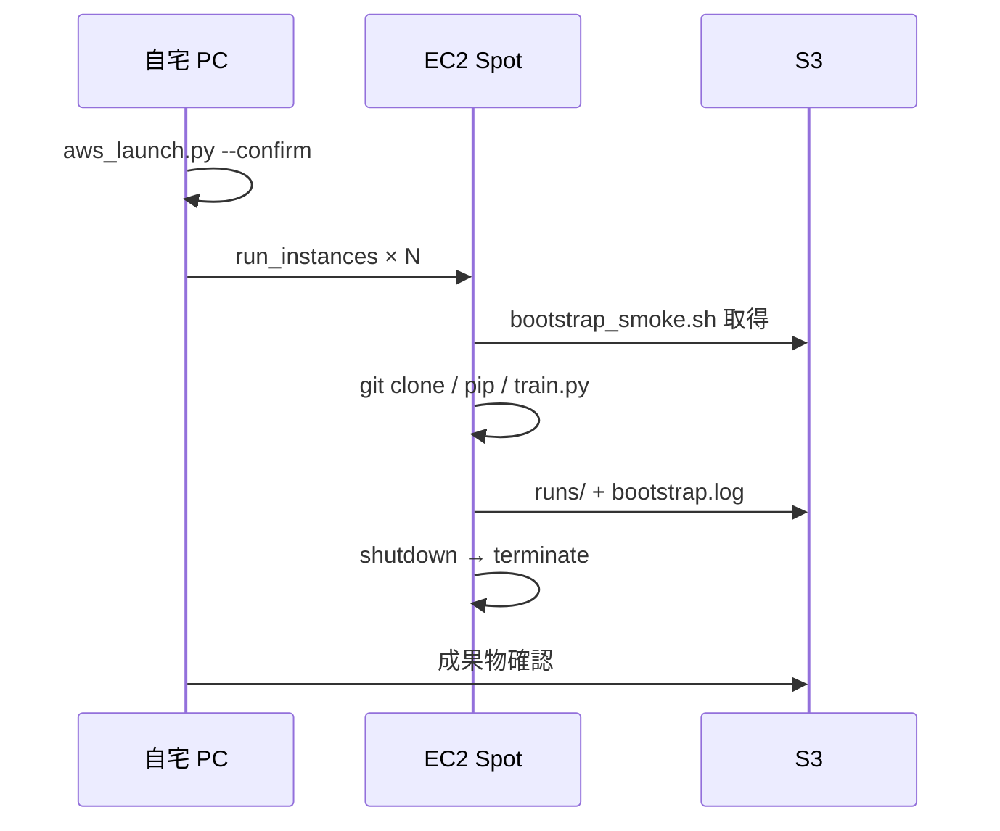

# AWS 上での exp_030 学習（新プロメテウス v0）

自宅 PC から **EC2 Spot** を起動し、各 VM で `train.py` を 1 本実行する最小ランチャーです。  
旧 LAN 向け `mujoco_rl_sim.dispatch`（Coordinator / Worker）とは別系統です。

| 項目 | 内容 |
|------|------|
| ランチャー | `mujoco-sim/mujoco_rl_sim/experiments/exp_030_biped_ppo_walk/scripts/aws_launch.py` |
| VM 内 bootstrap | `aws/bootstrap_smoke.sh`（S3 に配置） |
| ローカル設定 | `aws/aws_launch.config.toml`（**git 管理外**） |
| 設定テンプレ | `aws/aws_launch.config.example.toml` |
| 成果物 | S3 `s3://<bucket>/aws-test/<run_name>/` |

---

## 前提

- AWS アカウント（東京 `ap-northeast-1` 推奨）
- 自宅 PC に [AWS CLI](https://aws.amazon.com/cli/) 設定済み（`aws configure`）
- IAM ユーザ `yuuki-lab-admin` 等（EC2 起動権限）
- IAM ロール `yuuki-lab-worker-role`（VM が S3 に書き込む）
- S3 バケット（例: `yuuki-lab-runs-dev`）

**課金警告**: `aws_launch.py` を `--confirm` 付きで実行すると、**実行した人の AWS アカウント**で Spot EC2 が起動し課金が発生します。  
リポジトリを clone しただけでは何も起きません。

---

## 初回セットアップ

### 1. Python 依存（自宅 PC）

```powershell
pip install -r aws/requirements.txt
```

### 2. ローカル設定

```powershell
copy aws\aws_launch.config.example.toml aws\aws_launch.config.toml
```

`aws_launch.config.toml` を編集:

| キー | 内容 |
|------|------|
| `enabled` | 起動時は **`true`**（意図的 opt-in。example は `false`） |
| `security_group_id` | `sg-...` |
| `s3_bucket` | バケット名 |
| `ami_id` | 空なら Ubuntu 22.04 を自動解決 |

### 3. AWS 側（初回のみ）

- S3 バケット
- IAM ロール `yuuki-lab-worker-role`（S3 読み書き）
- セキュリティグループ（SSH はマイ IP のみ推奨）
- Spot 初回: ルートで Spot を 1 回起動しサービスリンクロールを作成（または IAM に `iam:CreateServiceLinkedRole`）

---

## 使い方（安全な流れ）

`exp_030_biped_ppo_walk` フォルダで:

```powershell
# 1. 計画確認（課金なし・AWS API 呼び出しなし）
python scripts/aws_launch.py --dry-run

# 2. 本番起動（enabled=true + --confirm 必須）
python scripts/aws_launch.py --seeds 1,2,3,4 --confirm --upload-bootstrap

# sweep YAML から先頭 4 seed（--parallel 既定 4）
python scripts/aws_launch.py --sweep sweeps/baseline_10seed.yaml --confirm --upload-bootstrap
```

### 安全装置

| 装置 | 説明 |
|------|------|
| `enabled = false`（既定） | 設定で明示 opt-in するまで EC2 / S3 upload しない |
| `--confirm` | 本番起動に必須。無いと abort |
| `--dry-run` | サマリとジョブ一覧のみ。API 未呼び出し |
| `--parallel 4`（既定） | 同時起動上限（いきなり 8 台にしない） |

### 主なオプション

| オプション | 説明 |
|-----------|------|
| `--parallel N` | 今回起動する台数上限（既定 **4**） |
| `--seeds 1,2,3,4` | seed を直接指定 |
| `--sweep FILE` | sweep YAML（`param_grid` 付きは v0 未対応） |
| `--upload-bootstrap` | 起動前に `bootstrap_smoke.sh` を S3 へ upload |
| `--config PATH` | 設定 TOML（既定: `aws/aws_launch.config.toml`） |

seed 未指定時は **1..parallel**（既定 1,2,3,4）を使用します。

---

## 1 job = 1 Spot VM の流れ



VM 内では `training.post_train_eval=false` の smoke 設定（`bootstrap_smoke.sh`）で学習します。  
本番 `training=prod` や W&B 有効化は bootstrap の調整で拡張します。

---

## 成果物の確認

```powershell
aws s3 ls s3://yuuki-lab-runs-dev/aws-test/ --recursive
```

典型パス:

```
aws-test/<sweep_id>_seed<N>_YYYYMMDD/bootstrap.log
aws-test/<sweep_id>_seed<N>_YYYYMMDD/runs/<run>/final.pt
```

自宅で ckpt を取得:

```powershell
aws s3 cp s3://yuuki-lab-runs-dev/aws-test/.../final.pt .\final.pt
```

---

## 手動スクリプト（参考）

MVP 検証時に使った低レベル資産（`aws_launch.py` が置き換え可能）:

| ファイル | 用途 |
|---------|------|
| `bootstrap_smoke.sh` | VM 内の学習セットアップ本体 |
| `user_data_seed1.sh` / `user_data_seed2.sh` | 手動 `run-instances` 用 User Data 例 |

---

## トラブルシュート

| 症状 | 対処 |
|------|------|
| `[abort] enabled が true ではない` | `aws_launch.config.toml` で `enabled = true` |
| `[abort] --confirm が必要` | 先に `--dry-run`、問題なければ `--confirm` |
| `ServiceLinkedRoleCreationNotPermitted` | ルートで Spot 1 回、または IAM ポリシー追加 |
| ディスク不足 | `ebs_volume_gb = 30`、`requirements-cpu.txt` で CPU 版 torch |
| `gymnasium` 不足 | `exp_030/requirements.txt` に含まれる（`pip install -r requirements.txt`） |

---

## 旧プロメテウス（LAN dispatch）との関係

| | LAN `dispatch` | AWS `aws_launch.py` |
|--|----------------|---------------------|
| 状態 | レガシー（参照用） | **現行 v0** |
| 司令塔 | 自宅 Coordinator | 自宅 CLI |
| Worker | 常駐 Pull | 短命 Spot VM |
| ドキュメント | [docs/prometheus.md](../docs/prometheus.md) | 本ファイル |
