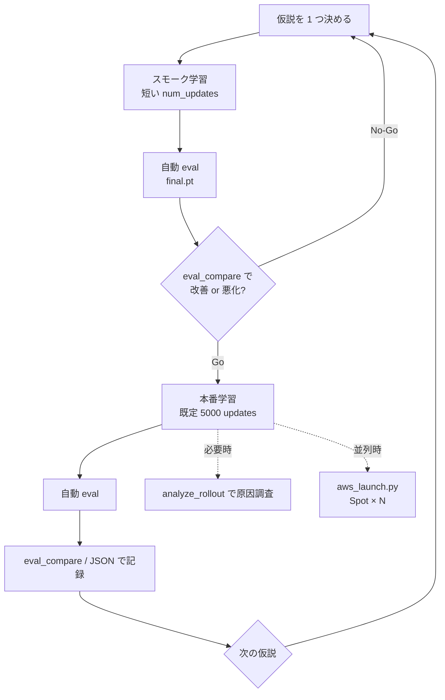

# exp_030 — 強化学習実験ワークフロー

探索段階の **標準手順**。公式の良し悪しは学習曲線（`train/ep_return_mean`）ではなく、  
固定プロトコルの **eval 主指標 `eval/displacement_x_mean`**（大きいほど前進）で判断する。

### 原則

| 原則 | 内容 |
|------|------|
| **1 run = 1 仮説** | 報酬係数・ENABLE フラグ・終了条件など、**変更は 1 軸ずつ** |
| **runs は exp_030 のみ** | `mujoco_rl_sim/runs/exp_030_biped_ppo_walk/`。exp_029 の runs は参照用 |
| **採点は eval v0** | `biped_walk_eval_v0`（50 試行）。デバッグは `analyze_rollout.py` |
| **比較は eval_compare** | 複数 run の `eval_report.json` を横並び。W&B summary・`dispatch_summary.json` は自動反映。**横断 UI は手動** |

### 全体フロー



### フェーズ別手順

#### 0. 準備（初回または環境変更時）

```bash
cd exp_030_biped_ppo_walk
pip install -r requirements.txt
python -m contract validate
```

- 変更する係数・フラグをメモ（後で run の `.hydra/config.yaml` と照合）
- W&B を使う場合: `wandb login`（省略時は `wandb=disabled` でローカルのみ）

#### 1. スモーク学習（仮説の粗い検証）

本番 5000 updates の前に、**短い学習で方向性だけ見る**。

```bash
python train.py training=smoke runtime=fast reward=forward55
# または単発 override
python train.py training.num_updates=300 reward.forward_reward_scale=55.0
```

| 項目 | 推奨 |
|------|------|
| `training=smoke` | 短い `num_updates`（200〜500、数分〜十数分） |
| `runtime=fast` | viewer/telemetry 無効・`num_envs=8`（スループット優先） |
| `reward=<preset>` | 仮説の 1 変更は **preset 1 つ** または **単一キー override** |
| 終了後 | **自動 eval** → `runs/<run>/eval_report.json` |

学習のみ試したい場合: `python train.py training.post_train_eval=false ...`（比較判断には eval が必要）

#### 2. 本番学習

スモークで Go なら本番。既定は `training=prod`（5000 updates）・`wandb=enabled`。

```bash
python train.py runtime=fast
# 仮説の reward preset を継続
python train.py runtime=fast reward=walk_shaping_on
```

| override / preset | 用途 |
|-------------------|------|
| `runtime.num_envs=N` | Subproc VecEnv の並列 env 数 |
| `resume=from_ckpt resume.checkpoint_path=<pt>` | 途中 ckpt から追加学習（**新 run ディレクトリ**・新 W&B run） |
| `ppo.lr=...` / `training.num_updates=...` | 再開時の上書き |
| `wandb=disabled` | run 名が `run_YYYYMMDD_HHMMSS` になる |
| `training.post_train_eval=false` | 学習後の自動 eval をスキップ（非推奨） |

**1 run の成果物**（`runs/exp_030_biped_ppo_walk/<run_name>/`）:

| ファイル | 内容 |
|----------|------|
| `.hydra/config.yaml` | その run で実際に効いた Hydra 設定の正本（再現用） |
| `update_*.pt` / `latest.pt` | 途中・最新 ckpt |
| `final.pt` | 学習完了 ckpt（**eval の対象**） |
| `eval_report.json` | 公式採点（train 終了時に自動生成） |

run ディレクトリ名: W&B 有効時は Run Name（例: `lunar-pond-4`）、`wandb=disabled` 時は `run_YYYYMMDD_HHMMSS`。

**旧 run**（`config_effective.json` のみ）: Hydra による完全再現の対象外。ckpt の eval / visualize は可能。

#### 3. 評価（手動・再採点）

自動 eval を上書き／再実行するとき:

```bash
python scripts/eval.py --checkpoint ../../runs/exp_030_biped_ppo_walk/<run>/final.pt
```

#### 4. 横断比較・意思決定

```bash
# 全 run を走査（eval_report があるものだけ）
python scripts/eval_compare.py

# CSV 残す
python scripts/eval_compare.py --csv compare.csv
```

| 判断 | 基準 |
|------|------|
| **ベスト ckpt** | `eval/displacement_x_mean` 最大（表の `*` 行） |
| **信頼区間** | `ci95` がプラスなら「前進」の根拠が強い |
| **安定性** | `truncated_rate`・`episode_length`・`termination_breakdown` を併読 |
| **No-Go** | 主指標が過去ベストを下回る、または CI が明確に悪化 |

次の仮説へ進む前に、**何を変えたか**を `.hydra/config.yaml` とセットで残す。

#### 5. デバッグ（必要時のみ）

公式比較には使わない。倒れ方・接触・時系列の確認用。

```bash
python scripts/analyze_rollout.py --checkpoint <run>/final.pt
python visualize.py --checkpoint <run>/final.pt
```

#### 6. 並列 sweep（AWS EC2 Spot・推奨）

**1 seed = 1 Spot VM**。自宅 PC から `scripts/aws_launch.py` で起動する（新プロメテウス v0）。  
詳細・初回セットアップ: リポジトリルート [aws/README.md](../../../mujoco-sim/aws/README.md)。

```powershell
# exp_030 ルートで（自宅 PC）
pip install -r ../../../mujoco-sim/aws/requirements.txt
copy ..\..\..\..\aws\aws_launch.config.example.toml ..\..\..\..\aws\aws_launch.config.toml
# aws_launch.config.toml を編集（security_group_id 等）し enabled = true

# 1) 計画確認（課金なし）
python scripts/aws_launch.py --dry-run

# 2) seed 1〜4 を 4 台並列（--parallel 既定 4）
python scripts/aws_launch.py --confirm --upload-bootstrap

# 3) sweep YAML から（先頭 4 seed）
python scripts/aws_launch.py --sweep sweeps/baseline_10seed.yaml --confirm --upload-bootstrap
```

| 安全装置 | 内容 |
|---------|------|
| `enabled = true` | 設定ファイルで明示 opt-in（うっかり課金防止） |
| `--confirm` | 本番 EC2 起動に必須 |
| `--dry-run` | サマリのみ（AWS API 未呼び出し） |

成果物は S3 `aws-test/<run_name>/`（`final.pt`・`bootstrap.log`）。比較は W&B または S3 から ckpt を取得して `eval_compare` / `visualize.py`。

**レガシー（LAN 複数 PC）**: 旧 `mujoco_rl_sim.dispatch`（Coordinator / Worker）は参照用。  
`python -m mujoco_rl_sim.dispatch.coordinator.cli plan --file sweeps/walk_reward_sweep_48.yaml` 等。詳細: `mujoco_rl_sim/dispatch/README.md`。

### 典型 1 サイクル（コピペ用）

```bash
# 1) スモーク
python train.py training=smoke runtime=fast reward=forward55

# 2) 比較
python scripts/eval_compare.py

# 3) 本番（Go の場合）
python train.py runtime=fast reward=forward55

# 4) 再比較
python scripts/eval_compare.py --csv compare.csv
```

### ワークフロー実装状況

#### 実装済み

| 項目 | 所在・備考 |
|------|------------|
| 学習 seed（`--seed` / `DISPATCH_SEED`） | `lib/training_seed.py` |
| 学習時 Domain Randomization（A+B+C） | `sim/domain_randomization.py`、既定 ON |
| W&B `run.summary` への eval 主指標 | `rl/wandb_logging.log_eval_report` |
| dispatch 台帳への eval 主指標 | `runs/<exp>/<run_id>/dispatch_summary.json` |
| pytest + GitHub Actions CI | `tests/`（34 本）、`.github/workflows/mujoco-rl-tests.yml` |
| スループット計測（レベル1） | `lib/train_throughput.py` |
| Subproc VecEnv（レベル2） | `sim/subproc_vec_env.py`、`runtime.num_envs` |
| Hydra 設定・run 再現 | `conf/`、`.hydra/config.yaml`、`lib/experiment_context.py` |
| AWS Spot 並列（v0） | `scripts/aws_launch.py`、`aws/bootstrap_smoke.sh`、[aws/README.md](../../../mujoco-sim/aws/README.md) |

#### 次の ROI（優先順）

| 優先 | 項目 | 状態 |
|------|------|------|
| 1 | PPO + rollout ループ効率化（GPU 往復削減・tensor バッファ・IPC 軽量化） | 未実装 |
| 2 | dispatch / 実験台帳での eval 横断比較 UI | 未実装 |
| 3 | eval 回帰ゲート（CI 第2段・ゴールデン ckpt） | 未実装 |
| 4 | N=12/16 ベンチ・sim hot path | ベンチ済（N=8 sweet spot）、`runtime=fast` 既定は 8 |
| 5 | 既存 run の一括 eval バッチ | 未実装 |

### 並列化・スループット・DR

Domain Randomization、Subproc VecEnv、スループット計測の詳細は [training-parallel.md](training-parallel.md) を参照。
