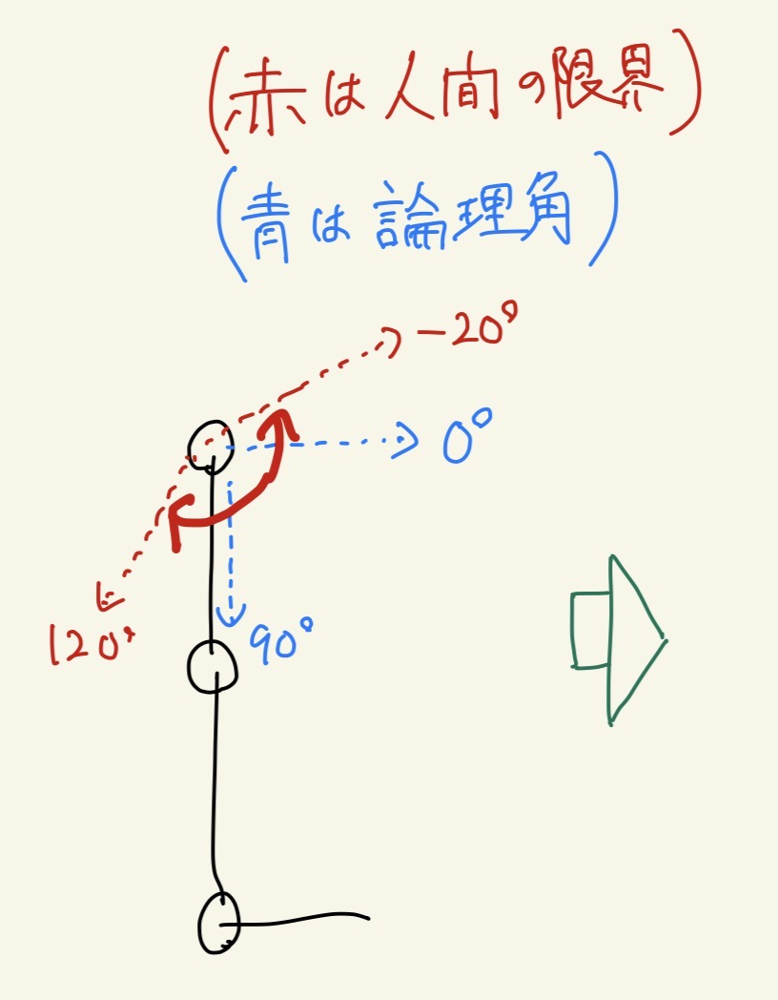

# 人間の関節運動（可動域・歩行時の角度・角速度）

角度は **解剖学基準**（伸展 0°、屈曲プラスが一般的）で記載。  
シミュレーションの **ヒンジ符号・軸** はモデルごとに異なる → [sim_human_comparison.md](sim_human_comparison.md) を必ず照合。

---

## 1. 可動域

### 股関節

真下から後ろに約30°まで、脚を前に上げると真下から約110°まで。  
論理角では-20°～120°

---

## 2. 平地歩行（~1.2 m/s）の関節角度

**歩行周期 100%** = 片脚の踵接地から次の踵接地まで。

### 膝（矢状面）

| 局面（% 周期） | おおよその角度 |
|---------------|---------------|
| 踵接地（0%） | **0〜5°**（ほぼ伸展） |
| 立脚中期 | 5〜15° 屈曲 |
| 遊脚中期（スイング） | **ピーク 60〜65°** 屈曲 |
| 踵接地前 | 伸展に戻り **0〜5°** |

### 足関節

| 局面 | 角度 |
|------|------|
| 踵接地 | 軽い底屈位（約 0〜10°）または背屈 |
| 立脚中期 | 背屈 **5〜15°**（脛骨前傾） |
| プッシュオフ | 底屈 **15〜25°** 付近 |
| 遊脚 | 背屈で足先クリアランス（**10〜15°** 以上） |

### 股関節（矢状面）

| 局面 | 角度 |
|------|------|
| 踵接地 | 20〜30° 屈曲 |
| 立脚末期 | 伸展へ **0〜10°** |
| 遊脚 | 最大 **30〜40°** 屈曲 |

---

## 3. 角速度・時間スケール

| 項目 | 健常歩行（目安） |
|------|-----------------|
| 歩行周期 | **1.0〜1.2 s**（片脚） |
| ケイデンス | **100〜120 step/min** |
| 膝角速度（スイング） | **300〜500 °/s** ピーク（≈ **5〜9 rad/s**） |
| 足関節角速度（プッシュオフ） | **200〜400 °/s** ピーク |

MuJoCo の `timestep` と制御周期（何 step に 1 回 `ctrl`）を決めるときの参考に。

---

## 4. 歩行の空間パラメータ

身長 170 cm・速度 1.2 m/s 付近の目安:

| 項目 | 値 |
|------|-----|
| 歩幅（stride） | **1.2〜1.4 m** |
| 歩隔（step length） | **60〜70 cm** |
| 歩行速度 | **1.0〜1.4 m/s**（快適） |
| 重心上下動 | **4〜8 cm** |
| 片脚支持時間比 | 歩行の **60〜62 %** |

---

## 5. RL 報酬設計への接続（本リポジトリ）

`env_010_a2c.py` では膝の「人間らしい後方屈曲」にボーナス:

| パラメータ | 値 | 人間データとの対応 |
|-----------|-----|-------------------|
| `KNEE_HUMAN_FLEX_MIN_RAD` | 0.02 rad（≈1°） | 立脚〜初期スイングのほぼ伸展に近い |
| `KNEE_HUMAN_FLEX_MAX_RAD` | 1.2 rad（≈69°） | スイング峰値 60〜65° **より控えめ**（早期にボーナス上限） |
| `ctrlrange` / `_max_ctrl_rad` | ±1.571 rad（±90°） | 解剖 ROM の一部のみ使用で足りる設計 |

**意図の整理**

- ボーナス帯 1°〜69°: 「少し曲げる〜中程度の屈曲」を促す。完全なスイング峰（60°+）まで必須ではない。
- 反対向き（過伸展側）ペナルティ: 人間の立脚期には合うが、座る・しゃがむ動作は別タスク。

---

## 6. よくある符号の落とし穴

| 人間の言い方 | 確認すること |
|-------------|-------------|
| 「膝を曲げる」 | ヒンジ軸（+Y / +Z）と `qpos` 増加方向が一致しているか |
| 「足首を背屈」 | 趾が上がる向きが `qpos` の + か − か |
| MuJoCo `ctrl` | `position` アクチュエータは **目標角度**であり、トルクではない |

007 ではコメント上、**膝ヒンジ +Y: `ctrl`/`qpos` > 0 が人間と同じ後方屈曲**と定義（`env_010_a2c.py`）。

---

## 参考文献

- Perry, J., & Burnfield, J. *Gait Analysis: Normal and Pathological Function*
- Whittle, M. W. *Gait Analysis: An Introduction*
- Winter, D. A. — 歩行周期ごとの角度・角速度グラフ
