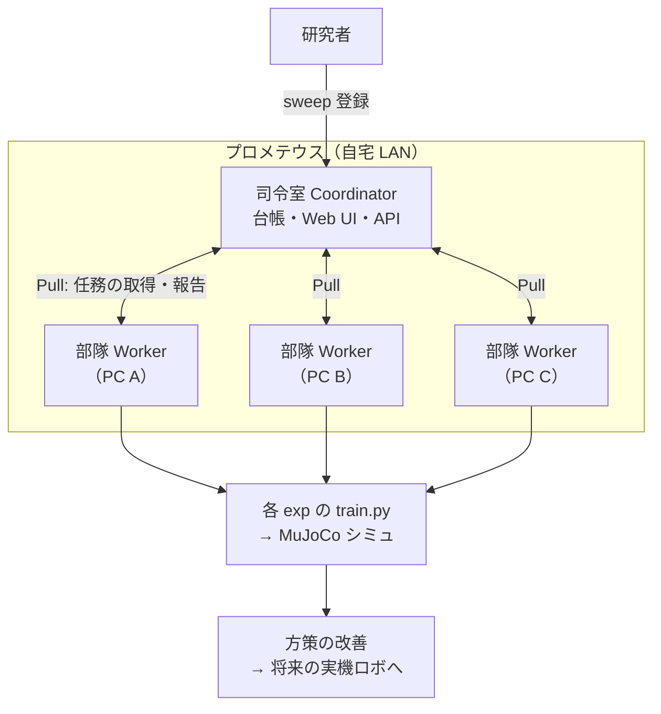
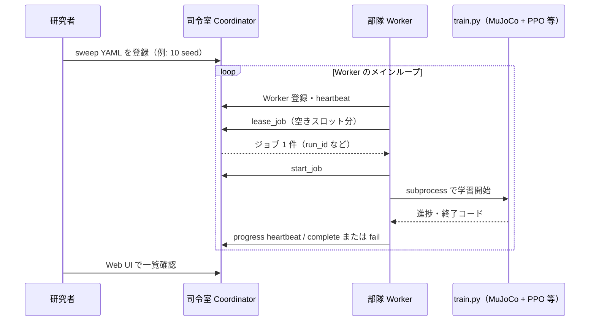
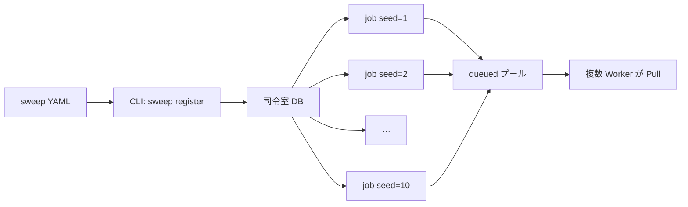
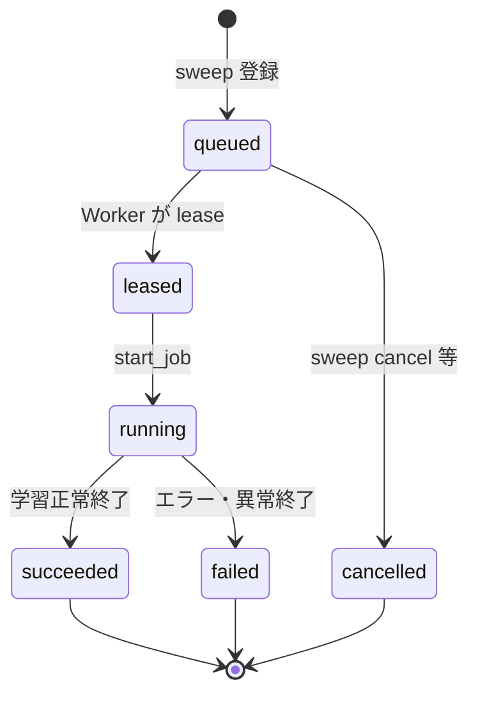
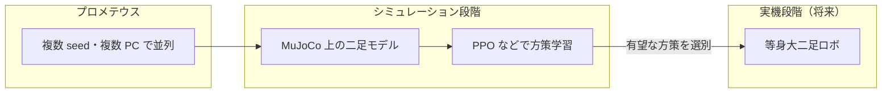

# プロメテウス（Prometheus）— 分散強化学習システム

等身大ロボット向けの AI 学習を、**自宅 LAN 上の複数 PC で並列に回す**ための仕組みです。  
システム名は **プロメテウス（Prometheus）**、実装パッケージ名は `mujoco_rl_sim.dispatch` です。

開発者向けのセットアップ手順は [dispatch README](../mujoco-sim/mujoco_rl_sim/dispatch/README.md) を参照してください。

---

## 1. なぜ作ったか

強化学習（RL）は、シミュレーション上でロボットを何度も転ばせながら方策（制御のルール）を改善します。1 回の学習でも長時間かかり、さらに **乱数 seed（運）を変えた複数回** の比較が必要になることがよくあります。

| 課題 | プロメテウスでの対応 |
|------|----------------------|
| 1 台の PC だけでは終わらない | 複数マシンで **同時に別ジョブ** を実行 |
| 「今日は seed 1、明日は seed 2」と手動だと面倒 | **sweep（一括作戦）** で数十件をまとめて登録 |
| どれが終わったか分からなくなる | **司令室（Coordinator）** が状態を一覧化（Web UI） |

本番の等身大ロボで試す前に、MuJoCo 上の二足シミュ（例: `exp_026_biped_ppo_hop_balance`）で方策を育てる——その **育成ラインを工場化** するのが目的です。

---

## 2. 全体像（3 つの役割）

覚えるのは次の **3 役** だけで十分です。

| 役割 | 実装名 | やっていること |
|------|--------|----------------|
| **司令室** | Coordinator | ジョブ台帳（SQLite）、REST API、ブラウザ用 Web UI |
| **部隊** | Worker | 空きスロットがあるとき、司令室から **任務（ジョブ）を Pull** して `train.py` を実行 |
| **任務カード** | Job | 1 枚 = 1 回の学習ラン（実験 ID・seed・ハイパラ overrides など） |

複数の **sweep**（作戦）を登録でき、1 sweep の下に多数の job が並びます。



---

## 3. Pull 型ディスパッチとは

司令室が各 PC に「今すぐこれを実行しろ」と押し付けるのではなく、**Worker 側が「空きがあるので次のジョブをください」と取りに行く**方式です（**lease / Pull**）。

**メリット（ざっくり）**

- PC の台数や性能がバラバラでも、**空いている部隊だけ**が任務を受け取れる  
- Coordinator 1 台 + Worker 複数台、という構成が素直  
- ジョブは `queued` → `leased` → `running` → `succeeded` / `failed` と状態が追える  



各 Worker は `max_concurrent_jobs` 分だけ **並列スロット** を持ち、スロットが空くたびに新しいジョブを lease します。

---

## 4. sweep と job

### sweep（作戦）

YAML ファイルで「どの実験を、どの seed / パラメータグリッドで、何本回すか」を定義します。

例（10 seed のベースライン）:

```yaml
sweep_id: exp026_baseline_20260602_v2
exp_id: exp_026_biped_ppo_hop_balance
seeds: [1, 2, 3, 4, 5, 6, 7, 8, 9, 10]
shuffle_seed: 42
```

登録すると、司令室の DB に **10 枚の任務カード（job）** が作られ、キュー順（`shuffle_seed` でシャッフル）で並びます。



### job（1 回の学習ラン）

1 job には少なくとも次が紐づきます。

- `run_id` … 一意な実行 ID（ログ・成果物の名前に使う）  
- `exp_id` … どの実験フォルダの `train.py` か  
- `seed` … 乱数 seed（再現性・ばらつき評価）  
- `overrides_json` … そのランだけの設定上書き（例: `num_updates`）  

---

## 5. ジョブの状態

Web UI や API では、おおよそ次の流れで表示されます。



| 状態 | 意味 |
|------|------------------------|
| `queued` | 待機列に並んでいる |
| `leased` | どれかの部隊が取得済み（これから開始） |
| `running` | 学習実行中 |
| `succeeded` | 完了・結果報告済み |
| `failed` | 失敗（ログ・error_message を確認） |
| `cancelled` | キャンセル（未実行の queued など） |

実行中の `train.py` は、Web UI で sweep を delete しても **自動では止まりません**（台帳から消えるだけ）。停止は Worker / OS 側のプロセス管理が必要です。

---

## 6. 学習結果の行き先

1. **ローカル成果物** … `mujoco_rl_sim/runs/<exp_name>/` 以下にチェックポイントなど  
2. **実験フォルダのサマリ** … `dispatch_summary.json`（主指標など）  
3. **Weights & Biases（W&B）** … 有効な実験ではクラウド上の学習ログ（project / group / tag で整理）  
4. **司令室 DB** … 完了時に primary metric を報告し、Web UI で sweep 単位の進捗を表示  

Worker は学習開始時に環境変数で `DISPATCH_RUN_ID` や `DISPATCH_SWEEP_ID` などを `train.py` に渡し、どの作戦の何番目かを追跡できるようにしています。

---

## 7. ロボット開発との関係



プロメテウス自体は **シミュの外側の配備層** です。中で回るのは各 `experiments/exp_*/train.py`（現状の主戦場は二足ホップ平衡など）です。

---

## 8. 構成のイメージ（技術メモ）

| 層 | 技術 |
|----|------|
| 司令室 | Python / Flask、SQLite、静的 Web UI（`/api/*`、チェックポイント可視化 `/checkpoints`） |
| 部隊 | Python、`ThreadPoolExecutor` で `train.py` を subprocess 実行 |
| 認証 | 共有 API トークン（`X-Dispatch-Token`） |
| ネットワーク | 自宅 LAN（クラウド VM への自動スケールはしない） |

### チェックポイント可視化（Web UI）

- ページ: Coordinator の `/checkpoints`（トップのナビから遷移）
- 一覧: `mujoco_rl_sim/runs/` および `runs/archive/` 配下の各 `.pt`（`final.pt` / `update_*.pt` など 1 ファイル = 1 行）
- 起動: 行の「可視化」→ 対応 `experiments/<exp_id>/visualize.py`（archive は `experiments/archive/<exp_id>/`）を `--stochastic` 付きで subprocess 実行
- ビューアは **Coordinator を起動した PC** に開く。比較用に複数同時起動可（終了は各ビューアの閉じるボタン）

---

## 9. 関連リンク

| 資料 | 内容 |
|------|------|
| [dispatch README](../mujoco-sim/mujoco_rl_sim/dispatch/README.md) | インストール・CLI・環境変数 |
| [exp_026 AGENTS.md](../mujoco-sim/mujoco_rl_sim/experiments/exp_026_biped_ppo_hop_balance/AGENTS.md) | 現在の主実験（二足 PPO） |
| [control_timing_human_rl.md](control_timing_human_rl.md) | 人体制御と RL の step 周波数の背景 |

---

*最終更新: 2026-06*
