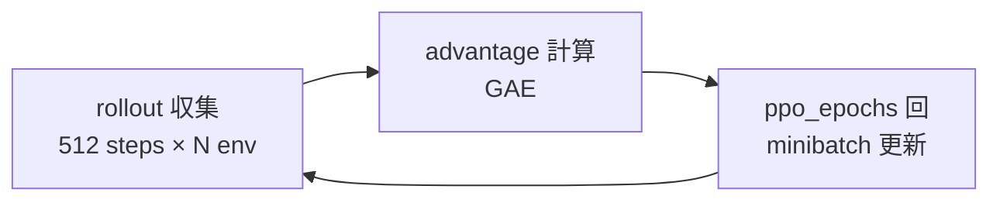

# PPO（Proximal Policy Optimization）

yuuki-lab **本線**の強化学習アルゴリズムです（exp_030）。  
論文: Schulman et al. 2017。

## 一行要約

**on-policy の方策勾配** を、更新幅を clip して安定化した algo。

## なぜ PPO か（歩行 RL）

| 理由 | 説明 |
|------|------|
| 連続制御向き | ガウス方策で関節トルクを直接出力 |
| 実装が堅牢 | TRPO より簡単で、多くのタスクで動く |
| on-policy | シミュレータがデータ源なら並列 rollout で十分速い |
| 業界標準 | ロボット歩行・操作のベースラインとして広く使われる |

## 1 回の update の流れ

1. 現在の方策 $\pi_{\theta_\text{old}}$ で `rollout_steps` 分のデータを集める  
2. GAE で advantage を計算  
3. 同じデータで `ppo_epochs` 回、minibatch に分けて更新  
4. 次の update へ（新しい rollout を収集）

exp_030 既定: `rollout_steps=512`, `ppo_epochs=8`, `minibatch_size=256`, `num_envs=8`（`runtime=fast`）

## クリップされた目的関数（直感）

重要度比 $r_t(\theta) = \frac{\pi_\theta(a_t|s_t)}{\pi_{\theta_\text{old}}(a_t|s_t)}$ を使い、

$$
L^\text{CLIP} = \mathbb{E}\left[ \min\left( r_t(\theta) A_t,\ \text{clip}(r_t(\theta), 1-\epsilon, 1+\epsilon) A_t \right) \right]
$$

- $A_t > 0$（良い行動）… $r_t$ が大きくなりすぎる更新を clip で抑える  
- $A_t < 0$（悪い行動）… 同様に急激な確率低下を抑える  

$\epsilon$ = `clip_eps: 0.2`（exp_030）

## 全体損失

$$
L = -L^\text{CLIP} + c_v L^\text{value} - c_e H(\pi)
$$

| 項 | 係数（exp_030） | 意味 |
|----|----------------|------|
| clip 損失 | — | 方策改善 |
| value 損失 | `value_coef: 0.5` | critic 学習 |
| entropy | `entropy_coef: 0.05` | 探索維持 |

## GAE

$$
A_t^\text{GAE} = \sum_{l=0}^{\infty} (\gamma\lambda)^l \delta_{t+l}
$$

| パラメータ | 既定 | 効果 |
|-----------|------|------|
| $\gamma$ | 0.99 | 将来報酬の重み |
| $\lambda$ | 0.95 | MC に近いほど分散↑ |

## 主要ハイパラと症状

| パラメータ | 上げすぎると | 下げすぎると |
|-----------|-------------|-------------|
| `lr` | 発散・激しい振動 | 学習が遅い |
| `clip_eps` | 更新が効かない | 不安定 |
| `ppo_epochs` | overfitting to batch | サンプル効率低下 |
| `entropy_coef` | ランダム行動のまま | 早期に探索停止 |
| `rollout_steps` | 1 update が重い | advantage 推定がノイジー |

詳細: [practice/hyperparameters.md](../practice/hyperparameters.md)

## 早期停止

`target_kl: 0.02` … 方策の KL が閾値を超えたら epoch を打ち切り、過度な更新を防ぐ。

## exp_030 での実装

| 項目 | 場所 |
|------|------|
| PPO 本体 | `rl/agent.py` |
| rollout 収集 | `contract/session.py` |
| Subproc VecEnv | `sim/subproc_vec_env.py` |
| 設定 | `conf/ppo/default.yaml` |

## よくある誤解

| 誤解 | 実際 |
|------|------|
| PPO なら何でも学習できる | 報酬設計が悪いと最適化は成功しても歩けない |
| rollout を増やせば常に良い | 512×8 env で十分なことが多い。ボトルネックは sim |
| ep_return が上がれば OK | eval 主指標で判断（[practice/evaluation.md](../practice/evaluation.md)） |

## 次に読む

- [practice/hyperparameters.md](../practice/hyperparameters.md)
- [yuuki-lab/exp030-bridge.md](../yuuki-lab/exp030-bridge.md)
- [experiments/exp_030/training-parallel.md](../../experiments/exp_030_biped_ppo_walk/training-parallel.md)
