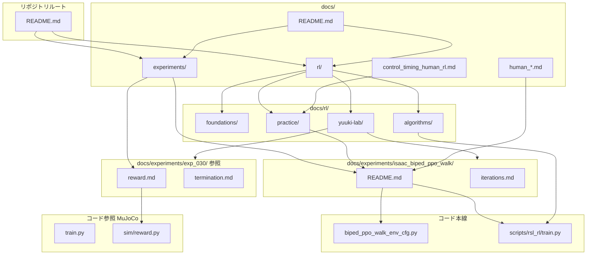

# ドキュメント関係図

yuuki-lab における RL 関連ドキュメントの全体像です。

## 役割の早見表

| パス | 役割 | 更新タイミング |
|------|------|---------------|
| `docs/rl/` | 汎用・学習用 | algo 理解を深めたとき |
| `docs/experiments/isaac_biped_ppo_walk/` | **本線**実験正本 | 目的・iterations・eval を変えたとき |
| `docs/experiments/exp_030_*/` | MuJoCo 参照 | 背景の報酬・終了を読むとき |
| `isaac-lab/` | 本線コード | 学習・報酬・終了を変えたとき |
| `mujoco-sim/.../exp_*/README.md` | MuJoCo 入口 | レガシー手順変更時 |
| `.cursor/skills/rl-improvement-loop/` | AI 改善ループ | 本線ワークフロー変更時 |

## 人体・実機 docs との関係

| ドキュメント | RL との接続 |
|-------------|------------|
| [human_joint_kinematics.md](../../human_joint_kinematics.md) | 歩行 shaping の意味 |
| [human_joint_torque.md](../../human_joint_torque.md) | トルク飽和・effort penalty |
| [control_timing_human_rl.md](../../control_timing_human_rl.md) | 50 Hz 制御 step |
| [sim_human_comparison.md](../../sim_human_comparison.md) | 観測・軸の対応 |
