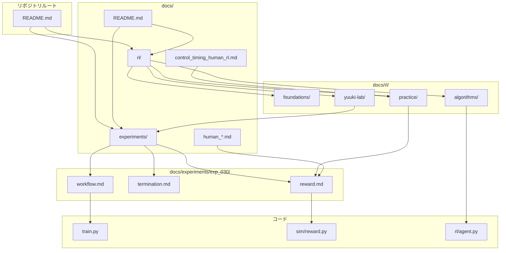

# ドキュメント関係図

yuuki-lab における RL 関連ドキュメントの全体像です。

## 役割の早見表

| パス | 役割 | 更新タイミング |
|------|------|---------------|
| `docs/rl/` | 汎用・学習用 | algo 理解を深めたとき |
| `docs/experiments/<exp>/` | 実験正本 | 報酬・終了・eval を変えたとき |
| `experiments/<exp>/README.md` | 入口 | 新 exp・手順変更時 |
| `experiments/<exp>/AGENTS.md` | AI 向け落とし穴 | 設計判断を変えたとき |

## 人体・実機 docs との関係

| ドキュメント | RL との接続 |
|-------------|------------|
| [human_joint_kinematics.md](../../human_joint_kinematics.md) | 歩行 shaping の意味 |
| [human_joint_torque.md](../../human_joint_torque.md) | トルク飽和・effort penalty |
| [control_timing_human_rl.md](../../control_timing_human_rl.md) | 50 Hz 制御 step |
| [sim_human_comparison.md](../../sim_human_comparison.md) | 観測・軸の対応 |
