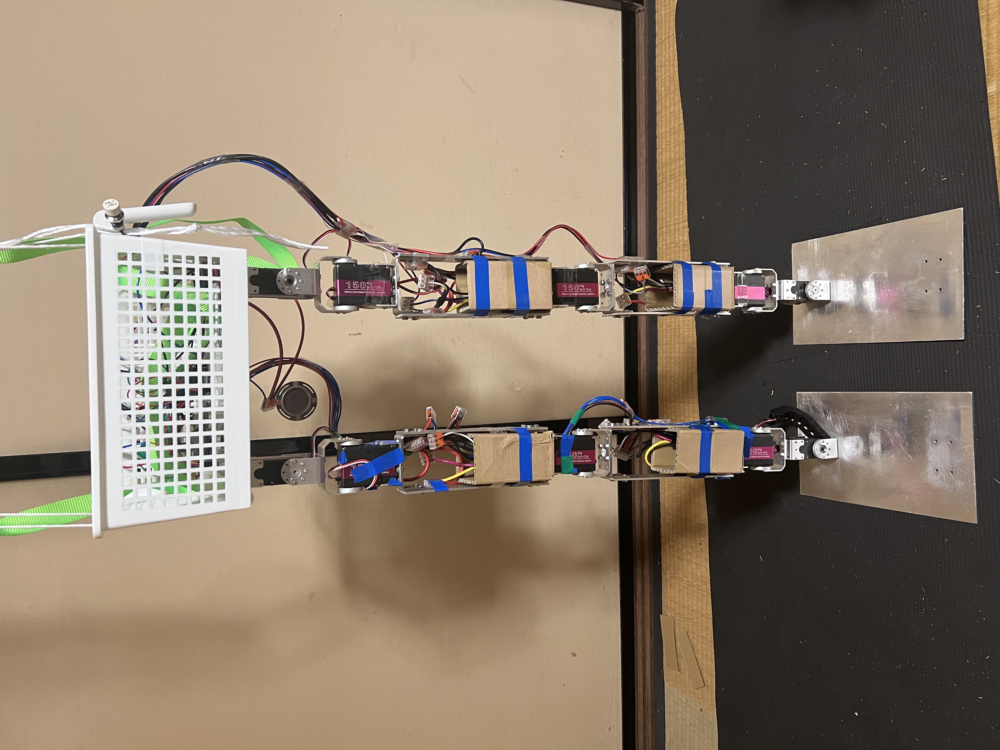
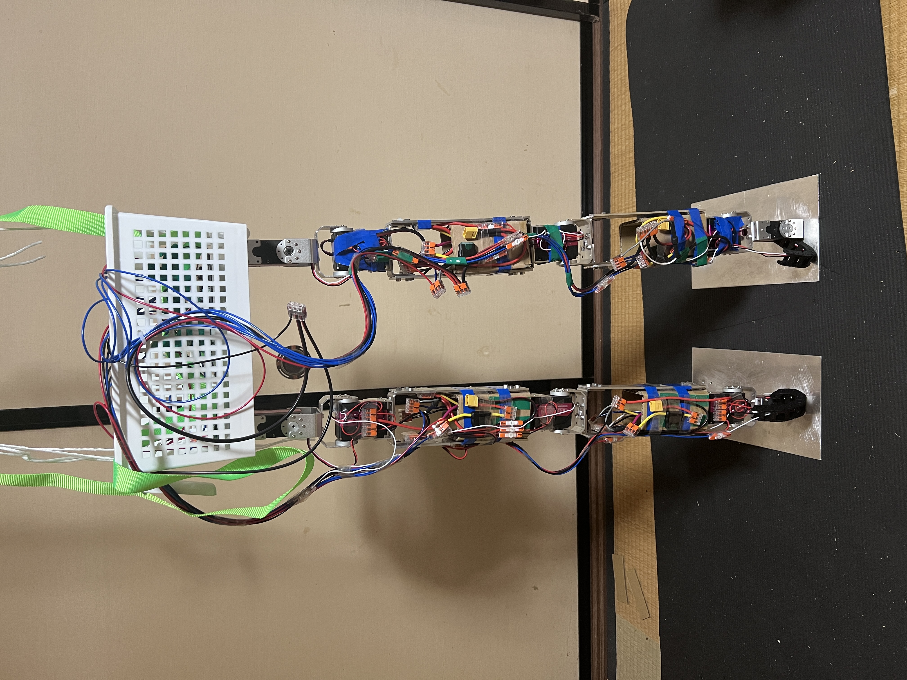
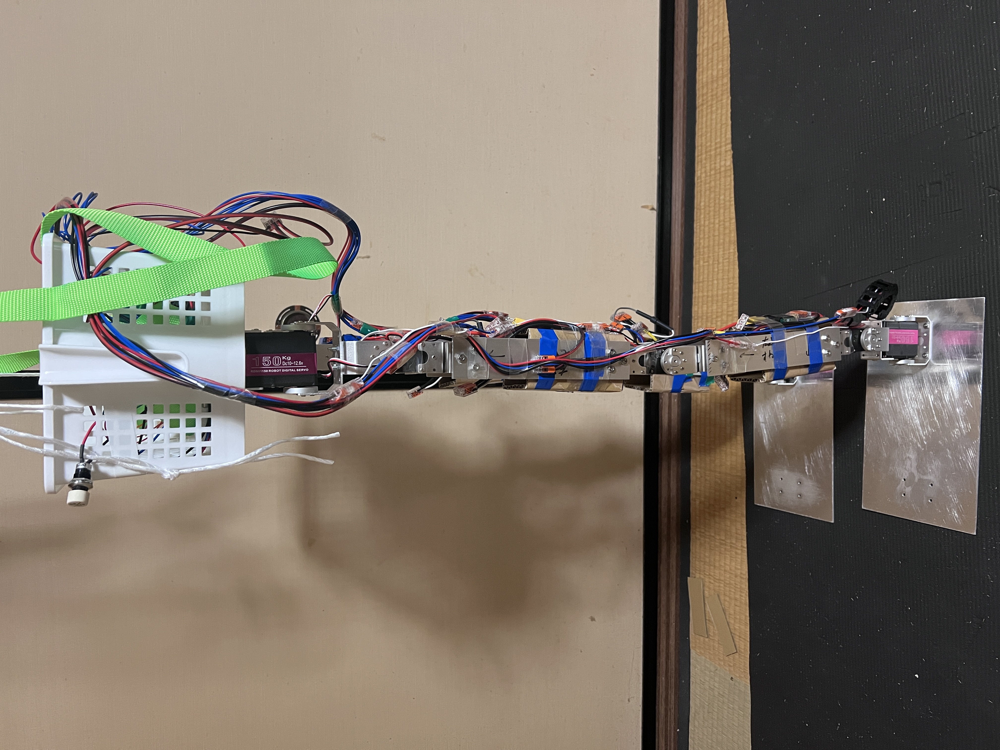
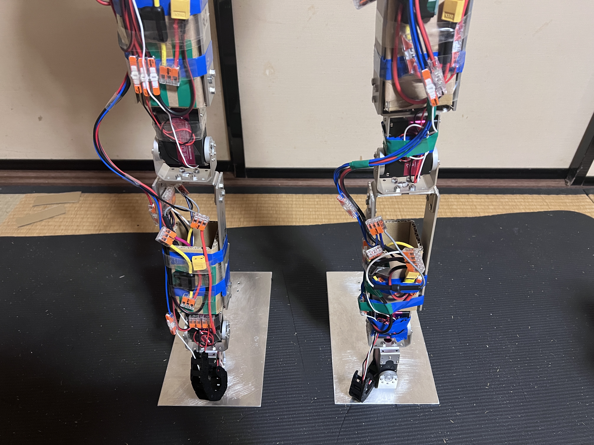
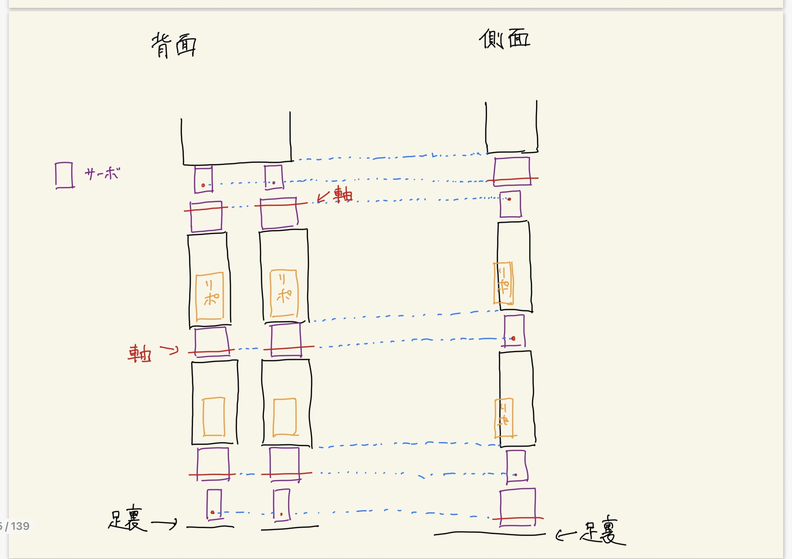
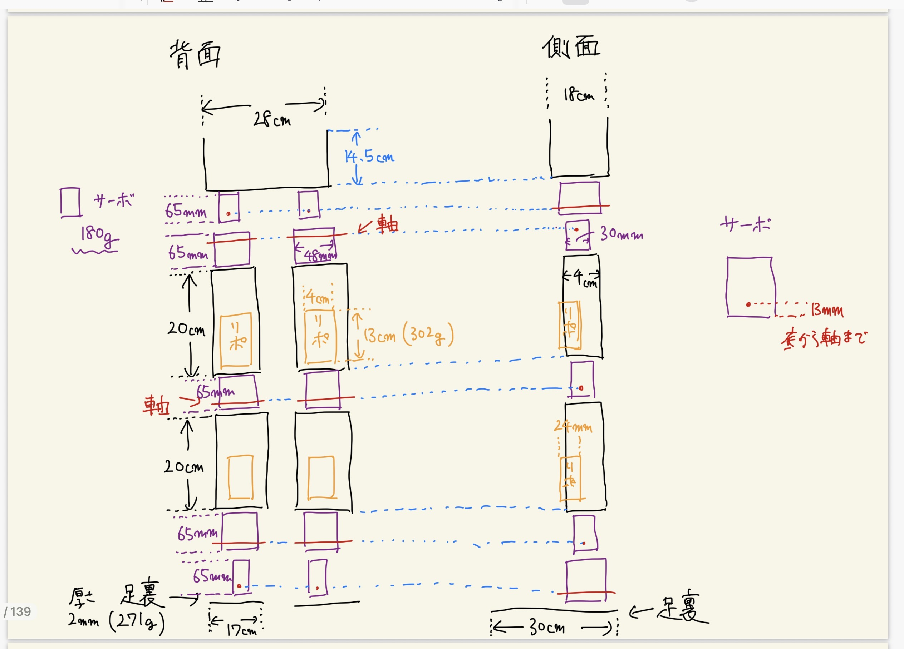
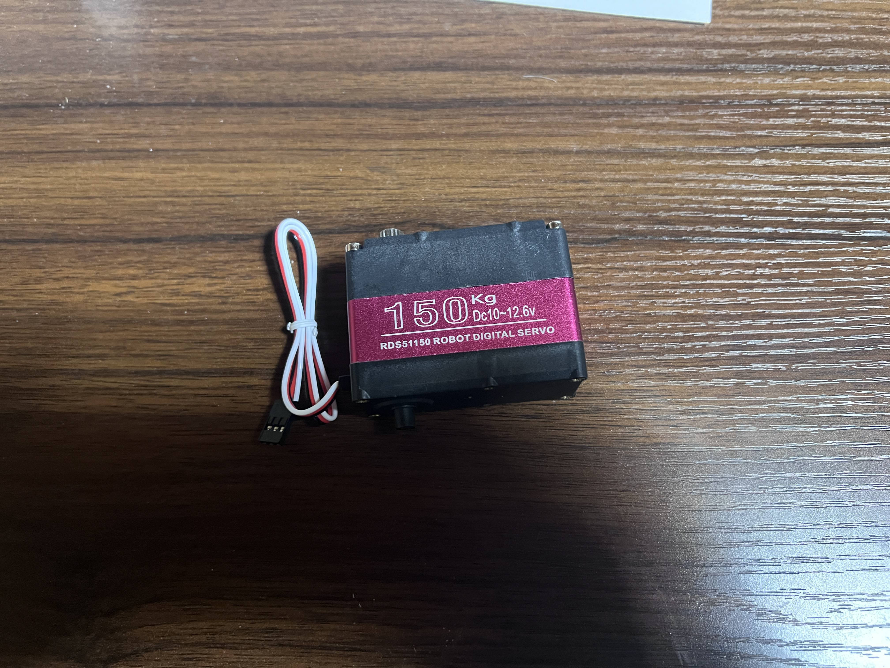
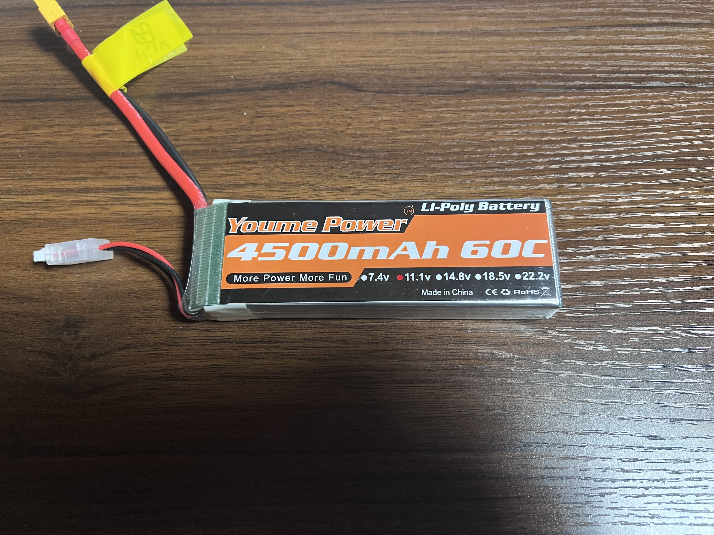

# ロボットのスペック

## 正面

### 白いカゴのサイズ

| 項目 | スペック |
|-----|-----|
| 幅 | 28 cm |
| 高さ | 14.5 cm |
| 奥行き | 18 cm |
| 重量 | ？ |

## 背面

## 側面（左から）

### 腿と脛のアルミフレーム

全てサイズが同じ。  
腿の両側に1枚ずつ。  
脛の両側に1枚ずつ。  
両脚で合計8枚。

↓ アルミ板1枚のサイズ・重量

| 項目 | スペック |
|-----|-----|
| 幅 | 4 cm |
| 長さ | 20 cm |
| 厚さ | 3 mm |
| 重量 | 63 g |

## 膝から下

### 足裏アルミ板のサイズ・重量

| 項目 | スペック |
|-----|-----|
| 幅 | 17 cm |
| 長さ | 30 cm |
| 厚さ | 2 mm |
| 重量 | 271 g |

## 設計図

## 使用しているサーボ

片脚について、股関節に2つ（ピッチ・ロール）、膝に1つ、足首に2つ（ピッチ・ロール）の合計5つ。  
両脚で合計10個の全く同じ150kgサーボ（RDS51150）を使用している。

↓ 150kgサーボのサイズ・重量

| 項目 | スペック |
|-----|-----|
| 幅 |  65mm |
| 高さ | 48 mm |
| 厚さ | 30 mm |
| 重量 | 180 g |

## 使用しているバッテリー

左右腿、左右脛の合計4箇所のバッテリーホルダーに1本ずつ、合計4本搭載。  
全て3Sリポバッテリー。4500mAh 60C。

↓ リポバッテリーのサイズ・重量

| 項目 | スペック |
|-----|-----|
| 幅 | 4 cm |
| 長さ | 13 cm |
| 厚さ | 24 mm |
| 重量 | 302 g |