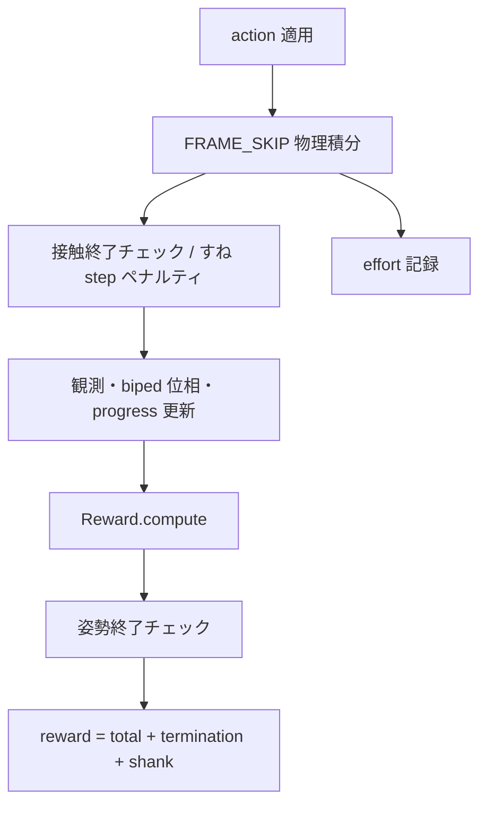

# exp_026: 拡大 MLP 両脚バイペッド PPO（スタンドアロン）

**学習・報酬・観測・モデル XML は [exp_025](../exp_025_biped_ppo_hop_balance/README.md) と同一**です。  
**差分は方策 / 価値ネットワークのみ**（`config.POLICY_HIDDEN_SIZES`）。

| 項目 | exp_025 | exp_026 |
|------|---------|---------|
| Actor / Critic MLP | 48→64→64→出力 | **48→256→256→128→出力** |
| 学習率 | 3e-4 | **2.5e-4** |
| 観測 / 行動 | 48 / 12 | **同一** |

`contract/`・`lib/`・`telemetry/`・`mujoco_sim_common/` を本フォルダに同梱し、**このディレクトリだけ**で実行できます。

## スタンドアロン実行

```bash
cd exp_026_biped_ppo_hop_balance
pip install -r requirements.txt

python train.py
python train.py --no-viewer --no-wandb --num-updates 2

python visualize.py
python analyze_rollout.py --checkpoint run_YYYYMMDD_HHMMSS/final.pt
python preview_warmup.py
```

- チェックポイント: `mujoco_rl_sim/runs/<フォルダ名>/`（実験フォルダ外）
- フォルダを別リポジトリへコピーしても、上記コマンドは同じ（フォルダ名が変わると `runs/` 配下名も変わる）

契約の観測 idx 表:

```bash
python -m contract markdown
```

---

## 概要

**exp_025 と同一**（48 次元観測 / 12 次元行動 / バランス棒付き XML / 報酬 shaping）。  
詳細は [exp_025](../exp_025_biped_ppo_hop_balance/README.md) を参照。本 exp の差分は上表の MLP・学習率のみ。

| 項目 | 値 |
|------|-----|
| 形態 | 両脚バイペッド + **カゴ上バランス棒**（`model/main.xml`、**12 DOF**） |
| 観測 / 行動 | **48 / 12** |
| 方策 MLP | **`POLICY_HIDDEN_SIZES = (256, 256, 128)`** |

---

## 観測設計

**48 次元**。idx 表の正本は `python -m contract markdown`（`contract/biped_v1.py`）。  
レイアウトの詳細は [exp_025 の観測設計](../exp_025_biped_ppo_hop_balance/README.md) を参照。

### 行動（ポリシー出力）

| 項目 | 内容 |
|------|------|
| 次元 | **10**（上記アクチュエータと 1:1） |
| 範囲 | 各成分 `[-1, 1]`（`clip_policy_action`） |
| 意味 | `action=0` は keyframe **`stand`** の関節角（中立姿勢）。`+1` は ctrlrange 上限側、`−1` は下限側（`lib/ctrl.py` の `action_to_ctrl`） |
| 観測との関係 | ベクトル末尾の `prev_action` は **当該ステップの action 適用前**の値（エージェントが意思決定に使った入力に含まれる 1-step 遅れ） |

### 観測に含めないもの

- 絶対位置 `imu_x`（エピソード原点からの相対距離は **報酬**の `progress_bonus` でのみ使用）
- 生の接触力・トルク（終了判定・床接触ペナルティは `termination.py` / `env.py` 側）
- 論理角（deg）はポリシー入力ではなく、テレメトリ表示用に `step_info` で別途算出

### 関連ファイル

- 観測組み立て: `observation.py`（`Observation.build`）
- 正規化: `lib/obs_norm.py`
- テレメトリ用スライス: `telemetry/biped_ppo.py` の `_obs_slices`（Hub 表示と idx 対応）

---

## 報酬設計

1 制御ステップ（`FRAME_SKIP` 回の物理積分後）のスカラー報酬は **`env.py`** で次のように合成されます。

```
reward = reward_result.total + termination.penalty + shank_penalty_sum
```

- `reward_result.total` … `reward.py` の `Reward.compute`（前進 + shaping − effort）
- `termination.penalty` … 転倒・不正接触による **エピソード終了**時のペナルティ（`termination.py`）
- `shank_penalty_sum` … すね geom の床接触に対する **ステップ毎**ペナルティ（終了はしない設定時）

以下、`Reward.compute` 内の内訳（`config.py` の係数と `reward.py` 内リテラル）に基づきます。

### ステップ報酬の構造（`reward.py`）

```
total = forward + shaping − effort_penalty

forward = forward_imu + forward_foot

shaping = upright_bonus + push_off_bonus + landing_bonus + progress_bonus
        − backward_lean_penalty − forward_lean_penalty − height_penalty
        − heading_misalign_penalty − lateral_tilt_penalty
        − flight_duration_penalty − knee_hyperflex_penalty
```

| 区分 | 記号 | 説明 |
|------|------|------|
| 前進 | `forward_*` | +X 方向の移動を正の報酬として与える |
| shaping | 各ボーナス/ペナルティ | 姿勢・高さ・遊脚・膝角などの誘導 |
| effort | `effort_penalty` | \|τ·q̇\| 積分ベース（**現状は報酬に未加算**、後述） |

### 前進報酬

前提（`reward.py` 内リテラル）:

- `FORWARD_REWARD_SCALE = 50.0`
- `FORWARD_MIN_UPRIGHT = 0.62`（`imu_zaxis` の Z 成分がこれ未満なら前進項 0）
- `FORWARD_REQUIRE_FOOT_CONTACT = False`
- `MAX_DX_PER_STEP = 0.5`（クリップ上限）

#### IMU 前進 `forward_imu`

```
dx_clipped = clip(dx, −MAX_DX_PER_STEP, MAX_DX_PER_STEP)
forward_imu = max(0, dx_clipped) × FORWARD_REWARD_SCALE × imu_forward_scale
```

- `dx` … 当該ステップの `imu_site` +X 移動量 [m]（`episode.prev_imu_x` との差）
- **飛翔中の前傾減衰**（`FORWARD_IMU_LEAN_GATE = True`）  
  両足非接地かつ `imu_zaxis_x > 0.10` のとき、前傾が強いほど `imu_forward_scale` を 0.15 … 1.0 に減衰:

  ```
  lean_excess = max(0, imu_zaxis_x − 0.10)
  imu_forward_scale = clip(1.0 − 4.0 × lean_excess, 0.15, ∞)
  ```

  接地中は常に `imu_forward_scale = 1.0`。

#### 足元前進 `forward_foot`

```
foot_dx = Σ max(0, left_foot_dx)  （左足接地時）
        + Σ max(0, right_foot_dx) （右足接地時）
forward_foot = max(0, clip(foot_dx, …)) × FORWARD_REWARD_SCALE
```

- `FORWARD_FOOT_ONLY_WHEN_CONTACT = True` … 少なくとも片足接地時のみ足元項を有効化

### Shaping 項（`config.py` + `reward.py` ヘルパ）

| 項 | 式（概念） | 主な定数 |
|----|-----------|----------|
| **upright_bonus** | `max(0, upright − UPRIGHT_BONUS_THRESH) × UPRIGHT_BONUS_SCALE`（`dx ≥ UPRIGHT_BONUS_MIN_DX` のとき） | `THRESH=0.60`, `SCALE=0.8`, `MIN_DX=0` |
| **push_off_bonus** | 常に 0 | `PUSH_OFF_BONUS_SCALE=0`（片脚ホッパ用・両脚では無効） |
| **landing_bonus** | 常に 0 | `LANDING_BONUS_SCALE=0` |
| **progress_bonus** | `progress_m × PROGRESS_REWARD_SCALE` | `SCALE=20.0`。`progress_m` はエピソード内 **最高 IMU +X** からの増分 [m]（`upright ≥ PROGRESS_MIN_UPRIGHT=0.60` のときのみ更新） |
| **backward_lean_penalty** | `max(0, −lean_fwd_body − LEAN_BACKWARD_THRESH) × SCALE` | ボディ +X 射影、`THRESH=0.12`, `SCALE=3.0` |
| **forward_lean_penalty** | 遊脚中、`max(0, lean_fwd_body − LEAN_FORWARD_THRESH) × SCALE` | `THRESH=0.14`, `MIN_AERIAL=2`, `SCALE=4.0` |
| **heading_misalign_penalty** | `max(0, HEADING_ALIGN_MIN − heading_align) × HEADING_MISALIGN_PENALTY_SCALE` | `MIN=0.85`, `SCALE=1.5` |
| **lateral_tilt_penalty** | `max(0, tilt_horiz − LATERAL_TILT_THRESH) × LATERAL_TILT_PENALTY_SCALE` | `THRESH=0.12`, `SCALE=2.5` |
| **height_penalty** | 目標高さ `TARGET_IMU_Z=0.55` [m] より低い分に比例ペナルティ | `IMU_HEIGHT_PENALTY_SCALE=2.0` |
| | 片足以上接地時: 目標を `TARGET_IMU_Z_STANCE=0.46` に緩和（`HEIGHT_PENALTY_SKIP_WHEN_STANCE=True`） | |
| | 両足非接地かつ `imu_z < HEIGHT_PENALTY_AERIAL_CRASH_Z=0.42` のとき係数 ×1.5 | |
| **flight_duration_penalty** | 両足非接地が `AERIAL_DURATION_PENALTY_AFTER_STEPS=8` を超えた分 × `AERIAL_DURATION_PENALTY_SCALE=0.12` | 長い遊脚を抑制 |
| **knee_hyperflex_penalty** | `max(left_knee, right_knee)` が `KNEE_HYPERFLEX_MAX_RAD=0.95` を超えた分 × `KNEE_HYPERFLEX_PENALTY_SCALE=2.5` | `KNEE_HYPERFLEX_AERIAL_ONLY=True` のとき接地中は 0 |

### 筋負荷（effort）

`effort.py` で各物理ステップの `|τ·q̇| / τ_max` を積分し、`EFFORT_PENALTY_SCALE=3.0` を掛けた値を算出します。

**ただし** `reward.py` 内 `APPLY_EFFORT_PENALTY = False` のため、**現行のステップ報酬には effort は加算されません**（`step_info.effort_power_cost` としてログのみ）。

### 終了・接触ペナルティ（`termination.py` → `env.py` で加算）

#### 姿勢・高さによる終了（`done_reason_pose`）

| 条件 | 理由 | ペナルティ |
|------|------|-----------|
| `imu_z` が下限未満（空中 `0.40` m / 接地中 `0.34` m） | `imu_z` | **−30** |
| `upright < 0.52` | `low_upright` | **−30** |
| `lean_fwd_body < −MAX_BACKWARD_LEAN_BODY`（0.38、ボディ後傾） | `backward_lean` | **−30** |

#### 床接触による終了（`done_reason_contact`）

バスケット本体・大腿 geom が床に触れた場合、法線力 [N] に応じたペナルティで終了:

```
penalty = clip(BASE + PER_N × excess_force, MIN, ∞)
BASE = −20, PER_N = −0.016, MIN = −200（床接触共通）
```

- バスケット接触: スケール **1.0**
- 大腿接触: スケール **0.5**

`CONTACT_SHANK_TERMINATES = False`（既定）のため、**すね接触ではエピソード終了しません**。

#### すね接触のステップペナルティ（非終了）

物理サブステップごとに、すね geom（`shank_link`, `right_shin_link`）の床接触があると、上記と同型の `_shank_step_penalty` を **累積**（`shank_penalty_sum`）。接触力が大きいほどペナルティ増。

### 報酬の流れ（1 step）



### 関連ファイル

| ファイル | 役割 |
|----------|------|
| `reward.py` | 前進・shaping の本体（`Reward.compute`） |
| `config.py` | shaping 係数の大半 |
| `termination.py` | 終了条件・床/姿勢ペナルティ |
| `effort.py` | 筋負荷コスト（ログ用） |
| `episode_state.py` | `prev_action`, `aerial_steps`, `progress_m` |
| `env.py` | 上記の合成・`step_info` 出力 |

---

## 学習

```bash
cd exp_026_biped_ppo_hop_balance
python train.py
```

高速学習のみ（ビューア・実時間待ちオフ）:

```bash
python train.py --no-viewer --step-wall-sleep 0
```

ビューアを表示したまま最速（毎ステップ sync のみ・sleep なし）:

```bash
python train.py --viewer-fast
# または
python train.py --step-wall-sleep 0
```

（既定の `ENABLE_VIEWER=True` なら `--viewer` は不要。実時間追従は `--step-wall-sleep` 省略時の既定どおり。）

ビューア表示 + テレメトリ OFF（Socket.IO 負荷を削減）:

```bash
python train.py --viewer-fast --no-telemetry
```

wandb ログ OFF:

```bash
python train.py --no-wandb
```

### 並列起動（PowerShell スクリプト）

`launch_parallel.ps1` で、ビューアなし・wandb 有効・テレメトリ OFF の学習を複数プロセス起動できる。

```powershell
cd exp_026_biped_ppo_hop_balance
.\launch_parallel.ps1              # 既定 10 本
.\launch_parallel.ps1 -Count 4     # 4 本だけ
.\launch_parallel.ps1 -RedirectLogs -LogDir logs\parallel
```

実行ポリシーで拒否される場合:

```powershell
powershell -ExecutionPolicy Bypass -File .\launch_parallel.ps1
```

確認・停止: `Get-Process python` / `Get-Process python | Stop-Process`（他の Python 作業も止まるので注意）。

## テレメトリ（robotics-hub）

**無効化:** `--no-telemetry`（起動ログに `[telemetry] disabled`）。`config.TELEMETRY_ENABLED` を上書きする。

**有効時:**

1. 上記 `train` を起動（`[telemetry] Socket.IO http://0.0.0.0:8791` が表示される）
2. robotics-hub の **学習テレメトリ**（`/training-telemetry`）を開く
3. 学習ストリームが `biped_ppo_v1` スキーマで観測・行動・報酬を表示する

`step-wall-sleep` スライダーで壁時計待ちを変更可能（0 で最速。学習 CLI の `--viewer-fast` と同じ）。

## 可視化

```bash
python visualize.py
python visualize.py --checkpoint run_YYYYMMDD_HHMMSS/final.pt
```

## exp_023 との違い

| 項目 | exp_023 | exp_024 |
|------|---------|---------|
| `model/main.xml` | 足裏 25×10 cm | **同一** |
| 前後傾き・後傾終了 | `imu_zaxis_x` | **`lean_fwd_body`** |
| ヨーずれ・水平傾き | なし | **shaping ペナルティ** |
| 比較ベースライン | exp_021 | **exp_023** |
