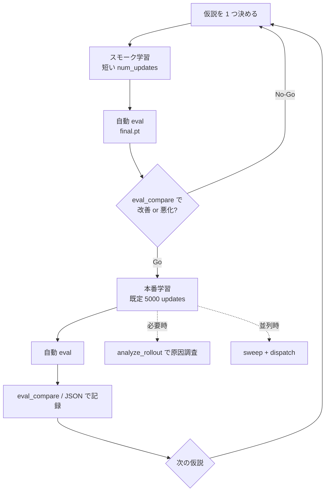

# exp_029: 交互片脚歩行 PPO（exp_028 コピー）

**exp_028** をコピーした作業用 fork です（2026-06）。**コピー時点でコードは exp_028 と同一**で、`runs/` のみ空から開始します。  
exp_028 の run 混在を整理し、以降の本線実験は本フォルダで行います。

| 項目 | exp_028 | exp_029 |
|------|---------|---------|
| コード | ミニマル報酬 preset（コピー元） | **コピー時同一**（以降は本フォルダで変更） |
| runs | 既存 run 混在 | **`runs/exp_029_biped_ppo_walk/` を新規使用** |
| ロールアウト | 単一 env 逐次 | **Subproc VecEnv**（`runtime.num_envs`、推奨 8） |
| 設定 | `config.py` + `--set` | **Hydra**（`conf/` + CLI override） |
| テスト / CI | なし | **pytest + GitHub Actions** |

タスク設計の源流は **exp_026** の MLP を維持した **交互片脚歩行** です。

| 項目 | exp_026 | exp_029 |
|------|---------|---------|
| 前進報酬 | 飛翔中も IMU `dx`、両足 `foot_dx` 合算可 | **片足支持時のみ** |
| すり足 | 抑制なし | **`double_support_penalty`** |
| 位相 | push/landing 無効 | **push / landing / 交互着地 / 遊脚離地** |
| 観測 | 48 次元 `biped_ppo_v1` | **51 次元 `biped_walk_v1`** |

## 強化学習実験ワークフロー（exp_029）

探索段階の **標準手順**。公式の良し悪しは学習曲線（`train/ep_return_mean`）ではなく、  
固定プロトコルの **eval 主指標 `eval/displacement_x_mean`**（大きいほど前進）で判断する。

### 原則

| 原則 | 内容 |
|------|------|
| **1 run = 1 仮説** | 報酬係数・ENABLE フラグ・終了条件など、**変更は 1 軸ずつ** |
| **runs は exp_029 のみ** | `mujoco_rl_sim/runs/exp_029_biped_ppo_walk/`。exp_028 の runs は参照用 |
| **採点は eval v0** | `biped_walk_eval_v0`（50 試行）。デバッグは `analyze_rollout.py` |
| **比較は eval_compare** | 複数 run の `eval_report.json` を横並び。W&B summary・`dispatch_summary.json` は自動反映。**横断 UI は手動** |

### 全体フロー



### フェーズ別手順

#### 0. 準備（初回または環境変更時）

```bash
cd exp_029_biped_ppo_walk
pip install -r requirements.txt
python -m contract validate
```

- 変更する係数・フラグをメモ（後で run の `.hydra/config.yaml` と照合）
- W&B を使う場合: `wandb login`（省略時は `wandb=disabled` でローカルのみ）

#### 1. スモーク学習（仮説の粗い検証）

本番 5000 updates の前に、**短い学習で方向性だけ見る**。

```bash
python train.py training=smoke runtime=fast reward=forward55
# または単発 override
python train.py training.num_updates=300 reward.forward_reward_scale=55.0
```

| 項目 | 推奨 |
|------|------|
| `training=smoke` | 短い `num_updates`（200〜500、数分〜十数分） |
| `runtime=fast` | viewer/telemetry 無効・`num_envs=8`（スループット優先） |
| `reward=<preset>` | 仮説の 1 変更は **preset 1 つ** または **単一キー override** |
| 終了後 | **自動 eval** → `runs/<run>/eval_report.json` |

学習のみ試したい場合: `python train.py training.post_train_eval=false ...`（比較判断には eval が必要）

#### 2. 本番学習

スモークで Go なら本番。既定は `training=prod`（5000 updates）・`wandb=enabled`。

```bash
python train.py runtime=fast
# 仮説の reward preset を継続
python train.py runtime=fast reward=walk_shaping_on
```

| override / preset | 用途 |
|-------------------|------|
| `runtime.num_envs=N` | Subproc VecEnv の並列 env 数 |
| `resume=from_ckpt resume.checkpoint_path=<pt>` | 途中 ckpt から追加学習（**新 run ディレクトリ**・新 W&B run） |
| `ppo.lr=...` / `training.num_updates=...` | 再開時の上書き |
| `wandb=disabled` | run 名が `run_YYYYMMDD_HHMMSS` になる |
| `training.post_train_eval=false` | 学習後の自動 eval をスキップ（非推奨） |

**1 run の成果物**（`runs/exp_029_biped_ppo_walk/<run_name>/`）:

| ファイル | 内容 |
|----------|------|
| `.hydra/config.yaml` | その run で実際に効いた Hydra 設定の正本（再現用） |
| `update_*.pt` / `latest.pt` | 途中・最新 ckpt |
| `final.pt` | 学習完了 ckpt（**eval の対象**） |
| `eval_report.json` | 公式採点（train 終了時に自動生成） |

run ディレクトリ名: W&B 有効時は Run Name（例: `lunar-pond-4`）、`wandb=disabled` 時は `run_YYYYMMDD_HHMMSS`。

**旧 run**（`config_effective.json` のみ）: Hydra による完全再現の対象外。ckpt の eval / visualize は可能。

#### 3. 評価（手動・再採点）

自動 eval を上書き／再実行するとき:

```bash
python scripts/eval.py --checkpoint ../../runs/exp_029_biped_ppo_walk/<run>/final.pt
```

#### 4. 横断比較・意思決定

```bash
# 全 run を走査（eval_report があるものだけ）
python scripts/eval_compare.py

# CSV 残す
python scripts/eval_compare.py --csv compare.csv
```

| 判断 | 基準 |
|------|------|
| **ベスト ckpt** | `eval/displacement_x_mean` 最大（表の `*` 行） |
| **信頼区間** | `ci95` がプラスなら「前進」の根拠が強い |
| **安定性** | `truncated_rate`・`episode_length`・`termination_breakdown` を併読 |
| **No-Go** | 主指標が過去ベストを下回る、または CI が明確に悪化 |

次の仮説へ進む前に、**何を変えたか**を `.hydra/config.yaml` とセットで残す。

#### 5. デバッグ（必要時のみ）

公式比較には使わない。倒れ方・接触・時系列の確認用。

```bash
python scripts/analyze_rollout.py --checkpoint <run>/final.pt
python visualize.py --checkpoint <run>/final.pt
```

#### 6. 並列 sweep（任意・LAN 複数 PC）

単発探索が主なら後回しでよい。報酬 3 軸の本線 sweep:

```bash
# Coordinator 側（mujoco-sim ルート等）
python -m mujoco_rl_sim.dispatch.coordinator.cli plan --file \
  experiments/exp_029_biped_ppo_walk/sweeps/walk_reward_sweep_48.yaml
```

各 job 完了後も **eval はローカル `eval_report.json`**。主指標は `dispatch_summary.json` にも載るが、**sweep 横断のリーダーボード UI は未実装**（比較は `eval_compare`）。  
詳細: `mujoco_rl_sim/dispatch/README.md`。

### 典型 1 サイクル（コピペ用）

```bash
# 1) スモーク
python train.py training=smoke runtime=fast reward=forward55

# 2) 比較
python scripts/eval_compare.py

# 3) 本番（Go の場合）
python train.py runtime=fast reward=forward55

# 4) 再比較
python scripts/eval_compare.py --csv compare.csv
```

### ワークフロー実装状況

#### 実装済み

| 項目 | 所在・備考 |
|------|------------|
| 学習 seed（`--seed` / `DISPATCH_SEED`） | `lib/training_seed.py` |
| 学習時 Domain Randomization（A+B+C） | `sim/domain_randomization.py`、既定 ON |
| W&B `run.summary` への eval 主指標 | `rl/wandb_logging.log_eval_report` |
| dispatch 台帳への eval 主指標 | `runs/<exp>/<run_id>/dispatch_summary.json` |
| pytest + GitHub Actions CI | `tests/`（34 本）、`.github/workflows/mujoco-rl-tests.yml` |
| スループット計測（レベル1） | `lib/train_throughput.py` |
| Subproc VecEnv（レベル2） | `sim/subproc_vec_env.py`、`runtime.num_envs` |
| Hydra 設定・run 再現 | `conf/`、`.hydra/config.yaml`、`lib/experiment_context.py` |

#### 次の ROI（優先順）

| 優先 | 項目 | 状態 |
|------|------|------|
| 1 | PPO + rollout ループ効率化（GPU 往復削減・tensor バッファ・IPC 軽量化） | 未実装 |
| 2 | dispatch / 実験台帳での eval 横断比較 UI | 未実装 |
| 3 | eval 回帰ゲート（CI 第2段・ゴールデン ckpt） | 未実装 |
| 4 | N=12/16 ベンチ・sim hot path | ベンチ済（N=8 sweet spot）、`runtime=fast` 既定は 8 |
| 5 | 既存 run の一括 eval バッチ | 未実装 |

### 学習時 Domain Randomization（v1）

| 項目 | 内容 |
|------|------|
| 対象 | 初期姿勢ノイズ（eval 同レンジ）・足底 slide friction・全 actuator kp/kv |
| タイミング | 学習 ``reset(episode_index=...)`` のみ（エピソードごと） |
| eval | **変更なし**（``reset_eval`` + 公式 eval ノイズ） |
| 既定 | **ON**（無効化: ``training.training_dr=false`` または ``python train.py training.training_dr=false``） |
| RNG | ``training_seed`` + ``episode_index``（eval seed とは独立） |

`visualize.py` / `scripts/eval.py` / `analyze_rollout.py` は DR **なし**（決定的 stand）。

### 学習スループット

学習ログ（``LOG_EVERY`` ごと）に **rollout / PPO update の壁時計** を表示する。最速設定:

```powershell
python train.py runtime=fast runtime.step_wall_sleep=0
```

（`launch_parallel.ps1` はプロセス並列。1 プロセスあたりの VecEnv は `runtime.num_envs` で指定）

#### レベル1: ボトルネック計測

| 指標 | 意味 |
|------|------|
| `rollout_s` | 環境ロールアウト収集 [s]（act_batch + vec step + store 等の合計） |
| `ppo_s` | PPO 勾配更新 [s] |
| `rollout_frac` | rollout が update 全体に占める割合 |
| `steps/s` | `ROLLOUT_STEPS / rollout_s` |

`rollout_frac` の読み方:

| 目安 | 意味 |
|------|------|
| **0.85 超** | sim 側がほぼ支配的（VecEnv 導入前の典型） |
| **0.65〜0.75** | VecEnv 導入後。PPO 側の最適化も効く |
| **0.5 未満** | PPO またはその他が支配的 |

W&B には ``train/rollout_fraction``・``train/act_batch_wall_s``・``train/ipc_wall_s`` 等も記録（``fav/*`` エイリアスあり）。

#### レベル2: Subproc VecEnv（ロールアウト物理並列）

``runtime.num_envs > 1`` のとき、**子プロセスが MuJoCo ``step``、親プロセスが方策推論 + PPO 更新** を担当する（SB3 ``SubprocVecEnv`` 相当）。子に方策モデルは載せない。子プロセスには run の ``.hydra/config.yaml`` パスを渡す。

```powershell
python train.py runtime=fast
python train.py runtime.num_envs=4
```

| 項目 | 内容 |
|------|------|
| 既定 | ``runtime=fast`` で ``num_envs=8``（`conf/runtime/fast.yaml`） |
| 1 update のサンプル数 | ``ROLLOUT_STEPS``（512）固定（SB3 流の 512×N にはしない） |
| 制約 | ``num_envs>1`` では viewer / telemetry / warmup 無効 |
| 通信 | ``multiprocessing.Pipe`` + pickle（軽量 ``step_info``） |
| ログ（`num_envs>1`） | ``num_envs``・``ipc_s`` をコンソールに追加 |

**`ipc_s` とは:** 親プロセスから見た ``vec_env.step()`` の累積壁時計 [s]。Pipe の send/recv **と** 子プロセス内 MuJoCo 実行 **と** 最遅 worker 待ちを含む（純粋な通信オーバーヘッドだけではない）。

**参考ベンチ**（Threadripper 2950X 16C / RTX 4080 SUPER、`--step-wall-sleep 0`、10 updates 平均）:

| `num_envs` | `avg_update_s` | `avg_steps/s` | `rollout_frac` | 全体 speedup |
|------------|----------------|---------------|----------------|--------------|
| 1 | 1.685 s | 345 | 0.88 | 1.00× |
| 4 | 0.834 s | 832 | 0.74 | 2.02× |
| 8 | 0.614 s | 1280 | 0.65 | **2.74×** |

N=4→8 は逓減（update 1.36×）のため、16C マシンでは **N=8 が実用的な sweet spot**。N=12/16 は任意ベンチで頭打ち確認。

実装: `sim/subproc_vec_env.py`・`sim/step_info_ipc.py`・`rl/agent.py`（``act_batch``）・`contract/session.py`（``_collect_rollout_subproc``）。

学習 seed の優先順位: Hydra `training.seed` > 環境変数 `DISPATCH_SEED` > 未指定（非決定的）。

## Hydra 設定

設定の正本は **`conf/`**。実行時は `ExperimentContext`（`lib/experiment_context.py`）に束ねられ、sim / rl / contract は **DI** で参照する。旧 `config.py`・`--set`・`config_effective.json` は廃止。

### config groups

| group | 役割 | 代表 preset |
|-------|------|-------------|
| `sim` | 物理・観測次元・方策 MLP | `default` |
| `reward` | 報酬 ENABLE・係数 | `baseline`（ミニマル）、`forward55`、`walk_shaping_on` |
| `ppo` | 学習率・clip・GAE | `default` |
| `termination` | 転倒閾値 | `default` |
| `training` | updates・seed・DR・post eval | `prod`（5000）、`smoke`（300） |
| `runtime` | viewer・telemetry・VecEnv | `fast`（本番推奨）、`debug_viewer` |
| `wandb` | W&B on/off | `enabled` / `disabled` |
| `resume` | ckpt 再開 | `none` / `from_ckpt` |

ルート: `conf/config.yaml`（`hydra.job.chdir: false` — cwd は実験ルートのまま）。

### 起動例

```bash
# 既定（training=prod, runtime=fast, wandb=enabled, reward=baseline）
python train.py

# スモーク + 報酬仮説
python train.py training=smoke runtime=fast wandb=disabled reward=forward55

# 単一キー override（Hydra 構文）
python train.py reward.forward_reward_scale=55.0 training.num_updates=1 wandb=disabled

# 過去 run の完全再現（W&B init 前に config を読む）
python train.py --config-path ../../runs/exp_029_biped_ppo_walk/<run>/.hydra --config-name config
```

`justfile` に同等レシピあり（`just smoke`、`just train-fast` 等）。

### dispatch 連携

dispatch 本体は未改修。job 起動時は次の 2 経路で Hydra cfg に反映される（**後勝ち**）:

1. **legacy argv ブリッジ** — 旧 `--set` / `--num-envs` 等を Hydra override に変換（`lib/dispatch_argv_bridge.py`）
2. **`DISPATCH_CONFIG_OVERRIDES_JSON`** — sweep キーをネストパスへマージ（`lib/dispatch_cfg_merge.py`）

eval / visualize / analyze は ckpt 親 run の `.hydra/config.yaml` から `ExperimentContext` を復元する（eval 本体の試行条件は `eval/` 固定 preset）。

## 実行

```bash
cd exp_029_biped_ppo_walk
pip install -r requirements.txt
python train.py
python visualize.py --checkpoint ../../runs/exp_029_biped_ppo_walk/<run>/final.pt
```

### テスト（pytest）

```bash
pip install pytest
python -m pytest tests/ -q -m "not slow"   # 高速のみ（Hydra / eval / 契約 / 報酬）
python -m pytest tests/ -q                 # slow 含む（MuJoCo reset・1-update 学習・Subproc）
```

slow テストには **Subproc VecEnv**（`tests/subproc_vec_env_smoke_main.py` を subprocess 実行）と **`num_envs=2` の 1-update 学習スモーク** を含む。Windows ``spawn`` 向けに VecEnv 単体は pytest から直接 ``multiprocessing`` 起動しない。

リポジトリ CI: `.github/workflows/mujoco-rl-tests.yml`（push / PR で `mujoco-sim/**` 変更時）。

補助 CLI:

```bash
python scripts/analyze_rollout.py --checkpoint run_YYYYMMDD_HHMMSS/final.pt
python scripts/eval.py --checkpoint run_YYYYMMDD_HHMMSS/final.pt
python scripts/preview_warmup.py
.\scripts\launch_parallel.ps1
```

契約表: `python -m contract markdown`

## 評価仕様（evaluation setup）

学習済みチェックポイントを **固定条件** で採点し、`eval_report.json` を出力する。  
sweep ランキング用ではなく、**1 ckpt の性能を mean ± std で把握**するのが目的。

| 項目 | v0（日常評価） |
|------|----------------|
| 仕様 ID | `biped_walk_eval_v0`（`eval/spec.py`） |
| 試行数 | **10 seed × 5 ep = 50** |
| eval_seeds | `101, 102, …, 110` |
| ポリシー | **deterministic**（`act_eval`） |
| warmup | **False**（学習と同じ） |
| エピソード長 | `MAX_STEPS_PER_EPISODE`（30 s） |

### 初期姿勢ノイズ（eval のみ・`stand` keyframe 適用後）

| 対象 | ノイズ |
|------|--------|
| ルート X/Y 位置 | **なし**（平面タスク） |
| ルートヨー | ±3° |
| 関節角 12 DOF | ±2°（`jnt_range` でクリップ） |
| ルート線速度 | 各軸 ±0.05 m/s |
| ルート角速度 | 各軸 ±0.1 rad/s |

RNG: `np.random.default_rng([eval_seed, ep_index])`（50 試行すべて別ノイズ）。  
`origin_imu_x` は **ノイズ適用後** の IMU 世界 X。

### 主指標・副指標

| 種別 | 指標 |
|------|------|
| **Primary** | `displacement_x = final_imu_x - origin_imu_x` の mean |
| 統計量 | mean, std, min, max, 95%CI（全 50 試行） |
| Secondary | `episode_length`, `truncated_rate`, `termination_breakdown`, `alternating_landing_rate`, `single_support_ratio`, `double_support_ratio` |

### 実行・出力

```bash
python scripts/eval.py --checkpoint run_YYYYMMDD_HHMMSS/final.pt
# 省略時: <checkpoint 親>/eval_report.json
python scripts/eval.py --checkpoint ... --out path/to/eval_report.json
```

| ツール | 用途 |
|--------|------|
| `scripts/eval.py` | 公式採点（統計・JSON） |
| `scripts/eval_compare.py` | 複数 run の `eval_report.json` 横断比較（表・CSV） |
| `scripts/analyze_rollout.py` | デバッグ（時系列 JSON・代表フレーム PNG） |

**学習終了後**は `train.py` が自動で `final.pt` を eval し、同 run ディレクトリに
`eval_report.json` を書き出す（スキップ: `training.post_train_eval=false`）。

v0 は **JSON のみ**（W&B / dispatch 連携は未実装）。手動再 eval は `scripts/eval.py`。

### run 横断比較（CLI）

`eval_report.json` がある run だけを拾い、主指標 `eval/displacement_x_mean` の降順で一覧する。

```bash
# 既定: runs/exp_029_biped_ppo_walk/ を走査
python scripts/eval_compare.py

# 特定 run のみ
python scripts/eval_compare.py ../../runs/exp_029_biped_ppo_walk/run_20260605_130101

# CSV 出力
python scripts/eval_compare.py --csv compare.csv
```

`eval_spec_id` が `biped_walk_eval_v0` と異なる report は `!` 列と警告で示す。

## ディレクトリ構成

| パス | 内容 |
|------|------|
| `train.py`, `visualize.py` | 学習・可視化の入口（`@hydra.main`） |
| `conf/` | Hydra 設定正本（YAML + `schema/app_config.py`） |
| `lib/experiment_context.py` | 実行時設定の束ね（DI ルート） |
| `package_meta.py`, `_paths.py` | パス・メタ |
| `sim/` | 環境・観測・報酬・終了・warmup |
| `rl/` | PPO・チェックポイント・W&B |
| `eval/` | チェックポイント評価（仕様・ノイズ・集計・レポート） |
| `scripts/` | `eval.py`・ロールアウト解析・warmup プレビュー・並列学習 |
| `contract/` | 観測契約 `biped_walk_v1`・PPO ループ |
| `lib/` | ctrl・正規化・Hydra 保存・dispatch マージ |
| `telemetry/`, `mujoco_sim_common/` | Hub・viewer 共有 |

## コードリーディングの手引き

人間・AI 共通の入口。**報酬設計**は本 README の「報酬設計」節、**観測 idx 表**は `python -m contract markdown`、**落とし穴**は [AGENTS.md](AGENTS.md) を参照。

### 最初に押さえる 3 点

| 項目 | 場所 | 内容 |
|------|------|------|
| 係数・次元 | `conf/` + `ExperimentContext` | 報酬 scale、51 次元、方策 MLP、制御 50 Hz |
| 歩行の定義 | `sim/reward.py` + `sim/episode_state.py` | 片足支持ゲート、交互着地、すり足抑制 |
| 契約 | `contract/biped_walk_v1.py` | 観測スライス・テレメトリ schema `biped_walk_v1` |

### 推奨読み順（タスク理解）

目的別に **深掘りしたいファイルから逆順** に読んでもよい。

1. **`conf/config.yaml` + `conf/reward/`** … 何を学習させたいか（係数・ENABLE の一覧）
2. **`sim/episode_state.py`** … 片足支持・着地エッジ・交互着地・`aerial_steps` の更新
3. **`sim/reward.py`** … `Reward.compute` で前進/shaping を合成（歩行とホップの分岐点）
4. **`sim/observation.py`** … 51 次元 `PolicyObs` の組み立て・正規化
5. **`sim/termination.py`** … 転倒・床接触の終了条件（詳細は README「終了条件と終了ペナルティ」）
6. **`sim/env.py`** … 上記を 1 制御ステップに束ねる（`step()` が中心）
7. **`train.py`** → **`contract/session.py`** … 学習ループ（薄い入口 + 共通 PPO ループ）
8. **`rl/agent.py`** … PPO 本体（exp_026 と同一 MLP 形状ならここは差分小）

### 1 制御ステップの流れ（`env.step`）

```
action [-1,1]^12
  → lib/action.py（stand keyframe 基準で ctrl 写像）
  → FRAME_SKIP 回 mj_step（sim/termination: 接触終了・すね step ペナルティ）
  → sim/observation.build（PolicyObs + StepPhysics）
  → sim/episode_state.advance_biped_context / advance_progress
  → sim/reward.compute
  → sim/termination.done_reason_pose
  → reward, obs_vector, step_info
```

学習時は `contract/session.py` がこれを `ROLLOUT_STEPS` 分繰り返し → `rl/agent.py` の `update()`。

### ディレクトリ × 変更したいとき

| 変更したい内容 | 触るファイル |
|----------------|--------------|
| 報酬係数・ハイパラ | `conf/reward/*.yaml`（sweep は `DISPATCH_CONFIG_OVERRIDES_JSON`） |
| 歩行 shaping の式 | `sim/reward.py` |
| 観測次元・正規化 | `sim/observation.py` + `contract/biped_walk_v1.py` + `conf/sim/default.yaml` |
| 転倒条件 | `conf/termination/` + `sim/termination.py` |
| ロボット・接触 geom | `model/main.xml` + `lib/actuators.py` |
| 方策ネット | `rl/agent.py` + `conf/sim/default.yaml`（`policy_hidden_sizes`） |
| 学習ループ・warmup | `contract/session.py` + `sim/warmup.py` |
| Hub 表示 | `telemetry/` + `contract/telemetry.py` |

### エントリポイント早見

| コマンド | 入口 | 次に読む |
|----------|------|----------|
| `python train.py` | `train.py` → `run_ppo_train` | `contract/session.py` |
| `python visualize.py` | `visualize.py` → `EnvBipedPPO` | `sim/env.py` |
| `python -m contract markdown` | `contract/codegen.py` | `contract/biped_walk_v1.py` |
| sweep 並列 | `scripts/launch_parallel.ps1` | `lib/dispatch_cfg_merge.py` |

### 前後 exp との差分を追うとき

| 比較 | 見る場所 |
|------|----------|
| exp_026（ホップ主線） | `sim/reward.py` の `forward_allowed`・`double_support_penalty` 有無 |
| exp_028（コピー元・機能同一） | 本フォルダは runs 整理用 fork。差分は git diff で確認 |
| exp_008 系（片脚ホッパ） | **混同注意**: 飛翔中 IMU `dx` を主報酬に戻さない（[AGENTS.md](AGENTS.md)） |

観測 51 次元の idx 表は `contract/biped_walk_v1.py` か `python -m contract markdown` が正本。README の報酬節と併せて読む。

## sweep（約 50 run）

```bash
python -m mujoco_rl_sim.dispatch.coordinator.cli plan --file sweeps/walk_reward_sweep_48.yaml
```

| 探索軸 | 値 | 意図 |
|--------|-----|------|
| `double_support_penalty_scale` | 4, 8, 14 | すり足抑制の強さ |
| `alternating_landing_bonus_scale` | 0.25, 0.55 | 左右交互着地 |
| `forward_reward_scale` | 40, 55 | 前進 vs shaping のバランス |
| seed | 1–4 | 12 設定 × 4 = **48 job** |

LR は `ppo.lr=2.5e-4` 固定（`conf/ppo/default.yaml`、MLP 拡大時の exp_026 既定）。

## 報酬設計

実装の正本は **`sim/reward.py`**（`Reward.compute`）と **`conf/reward/*.yaml`**（ENABLE 群・係数）。  
歩行位相（片足支持・着地エッジ・飛翔ステップ数）は **`sim/episode_state.py`** が更新し、  
**`sim/env.py`** が報酬に加えて接触・姿勢終了ペナルティを合成する。

YAML キーは `reward.enable_*` / `reward.forward_*` 等（旧 `REWARD_ENABLE_*` の snake_case 版）。下表の「旧名」はコード内・dispatch キーとの対応用。

### 現行方針: ミニマル報酬（報酬地獄回避）

複数の shaping 項を同時に有効にすると係数干渉（報酬地獄）が起きやすいため、  
**`reward.enable_*` で項ごとに ON/OFF** し、まずは少数の主報酬だけで学習する（既定 preset: `reward=baseline`）。

**既定（ミニマル preset）で有効な項:**

| 項 | ENABLE（Hydra） | 意図 |
|----|-----------------|------|
| **forward_imu** | `reward.enable_forward=true` | 接地・直立時の IMU +X 移動に報酬（主報酬） |
| **effort_penalty** | `reward.enable_effort=true` | 筋力コストで無駄な動きを抑制 |
| 転倒終了ペナルティ | （常時・`termination.py`） | エピソード終了時のみ。ENABLE 対象外 |

**既定で無効な項:** 歩行 shaping（push/landing/交互着地/遊脚）、進捗、直立ボーナス、姿勢ペナルティ群、すり足・ホップ抑制、`forward_foot`。

前進ゲートもミニマル向けに緩和:

| 設定（Hydra） | 既定 | 備考 |
|---------------|------|------|
| `reward.forward_require_single_support` | `false` | `true` で片足支持時のみ前進（歩行 shaping 主線） |
| `reward.forward_imu_lean_gate` | `false` | `true` で飛翔中の前傾 IMU 前進を減衰 |
| `reward.forward_min_upright` | `0.50` | 歩行主線は `0.62` |

### ENABLE 群（`conf/reward/baseline.yaml`）

`sim/reward.py` の `compute()` 末尾で参照。`false` なら該当項は **0 固定**（係数 `*_scale` は温存）。

| Hydra キー | 旧 dispatch キー | 制御する報酬項 |
|------------|------------------|----------------|
| `reward.enable_forward` | `reward_enable_forward` | `forward_imu` |
| `reward.enable_forward_foot` | `reward_enable_forward_foot` | `forward_foot` |
| `reward.enable_progress` | `reward_enable_progress` | `progress_bonus` |
| `reward.enable_walk_shaping` | `reward_enable_walk_shaping` | `push_off_bonus`, `landing_bonus`, `alternating_landing_bonus`, `swing_clearance_bonus` |
| `reward.enable_upright_bonus` | `reward_enable_upright_bonus` | `upright_bonus` |
| `reward.enable_posture_penalties` | `reward_enable_posture_penalties` | 姿勢ペナルティ群 |
| `reward.enable_double_support` | `reward_enable_double_support` | `double_support_penalty` |
| `reward.enable_flight_duration` | `reward_enable_flight_duration` | `flight_duration_penalty` |
| `reward.enable_effort` | `reward_enable_effort` | `effort_penalty` |

**歩行 shaping 主線に戻す例:**

```bash
python train.py reward=walk_shaping_on \
  reward.forward_require_single_support=true \
  reward.forward_imu_lean_gate=true \
  reward.forward_min_upright=0.62
```

（`conf/reward/walk_shaping_on.yaml` は `baseline` を継承し shaping 群を ON）

dispatch sweep からも `DISPATCH_CONFIG_OVERRIDES_JSON` で上書き可能（`lib/dispatch_cfg_merge.DISPATCH_KEY_TO_CFG_PATH`）。

### 設計方針（exp_026 ホップ主線との差・参考）

歩行 shaping 主線を再有効化したときの狙い:

| 狙い | 手段 |
|------|------|
| **交互片脚歩行** | 前進報酬・進捗ボーナスは **片足支持時のみ**（`FORWARD_REQUIRE_SINGLE_SUPPORT`） |
| **すり足抑制** | 両足接地中の前進に `double_support_penalty`（`REWARD_ENABLE_DOUBLE_SUPPORT`） |
| **ホップ抑制** | 両足非接地が長続きすると `flight_duration_penalty`（`REWARD_ENABLE_FLIGHT_DURATION`） |
| **歩行位相の誘導** | push-off / landing / 交互着地 / 遊脚離地（`REWARD_ENABLE_WALK_SHAPING`） |
| **転倒・異常姿勢** | `sim/termination.py` でエピソード終了＋終了ステップにペナルティ |

### 1 制御ステップあたりの合成式

制御周期は **50 Hz**（`CONTROL_TIMESTEP_S = 0.02 s`、1 行動 = `FRAME_SKIP=10` 物理ステップ）。

```
reward_total = forward + shaping - effort_penalty
             + termination.penalty      # env.py（終了ステップのみ）
             + shank_penalty_sum        # env.py（物理ステップごと積算）
```

`reward.py` 内の分解:

```
forward  = forward_imu + forward_foot
shaping  = (歩行ボーナス合計) - (姿勢・すり足・ホップ等ペナルティ合計)
total    = forward + shaping - effort_penalty   # reward.py 出力
```

PPO 学習時は `reward_total` が `agent.store` に渡る（`REWARD_CLIP=20` で GAE 計算前にクリップ）。

### 歩行位相（`episode_state.py`）

`advance_biped_context` が毎ステップ `BipedStepContext` を返す。報酬の多くがここに依存する。

| フィールド | 定義 |
|------------|------|
| `single_support` | 左右のどちらか 1 足だけ床接触 |
| `single_support_side` | 左支持 `+1` / 右支持 `-1` / それ以外 `0` |
| `both_feet_on_floor` | 両足接地 |
| `left_landed` / `right_landed` | 非接地→接地の **立ち上がりエッジ** |
| `alternating_landing` | 前ステップが反対脚支持だった状態からの着地（左着地←右支持、右着地←左支持） |
| `aerial_steps` | 両足非接地の連続ステップ数（接地で 0 にリセット） |

`advance_progress` はエピソード内 IMU +X の最高値 `best_imu_x` を更新し、  
`progress_m = max(0, imu_x - best_imu_x)` を返す（片足支持・`upright ≥ PROGRESS_MIN_UPRIGHT` のときのみカウント）。

### 前進ゲート `forward_allowed`

`forward_imu` / `forward_foot` / `progress_bonus` はすべてこのゲートの内側でのみ正の寄与がある（`progress` は `advance_progress` 側でも同条件）。

```text
forward_allowed =
  upright ≥ FORWARD_MIN_UPRIGHT (既定 0.50)
  AND (任意足接地)           if FORWARD_REQUIRE_FOOT_CONTACT
  AND single_support         if FORWARD_REQUIRE_SINGLE_SUPPORT  # ミニマル preset: False
```

`FORWARD_IMU_LEAN_GATE=True` のとき、飛翔中（両足非接地）かつ `forward_allowed` のとき IMU 前進に **前傾ゲート** が掛かる（ミニマル preset では `False`）:

```text
imu_forward_scale = clip(1 - FORWARD_IMU_LEAN_GATE_SCALE * max(0, lean_fwd_body - THRESH), MIN_MULT, ∞)
forward_imu *= imu_forward_scale   # 前傾しすぎるホップ前進を減衰
```

### 報酬項一覧（`sim/reward.py`）

記号: `dx` = IMU +X 移動量/step、`stance_foot_dx` = 支持脚の +X 移動（片足支持時のみ）、  
`lean_fwd_body` / `heading_align` / `tilt_horiz` = `lib/pose.pose_metrics`、  
`upright` = IMU 上向き単位ベクトルの Z 成分。

#### 前進 `forward`（主報酬）

| 項 | 条件 | 式（既定係数） | YAML（`reward.*`） |
|----|------|----------------|--------|
| **forward_imu** | `forward_allowed` | `clip(dx, 0, MAX_DX) * FORWARD_REWARD_SCALE * imu_forward_scale` | `FORWARD_REWARD_SCALE=50` |
| **forward_foot** | `forward_allowed` かつ片足支持 | `clip(stance_foot_dx, 0, MAX_DX) * FORWARD_REWARD_SCALE` | 同上 |

`MAX_DX_PER_STEP = 0.05 * FRAME_SKIP`（1 制御ステップあたりのクリップ上限）。

#### 歩行 shaping ボーナス（`shaping` に加算）

| 項 | 条件 | 式 | YAML（`reward.*`） |
|----|------|-----|--------|
| **upright_bonus** | `dx ≥ UPRIGHT_BONUS_MIN_DX` | `max(0, upright - THRESH) * SCALE` | `THRESH=0.60`, `SCALE=0.8` |
| **push_off_bonus** | 片足支持、支持脚 `foot_dx ≥ MIN`、かつ（膝伸展速度 or IMU 上昇） | 定数 `PUSH_OFF_BONUS_SCALE` | `0.22` |
| **landing_bonus** | 着地エッジ、つま先・かかと Z が低く、前傾が抑えめ | 定数 `LANDING_BONUS_SCALE` | `0.35` |
| **alternating_landing_bonus** | `alternating_landing` | 定数 `ALTERNATING_LANDING_BONUS_SCALE` | `0.45` |
| **swing_clearance_bonus** | 片足支持、遊脚が床から `SWING_MIN_FOOT_Z` 以上 | `max(0, swing_foot_z - MIN) * SCALE` | `MIN=0.04`, `SCALE=0.12` |
| **progress_bonus** | `progress_m > 0`（片足支持・直立で最高 IMU X 更新） | `progress_m * PROGRESS_REWARD_SCALE` | `20.0` |

push-off の膝伸展判定: 支持脚の膝角速度 `qvel < -PUSH_OFF_MIN_KNEE_EXT_VEL`（伸展方向）。

#### shaping ペナルティ（`shaping` から減算）

| 項 | 条件 | 式 | YAML（`reward.*`） |
|----|------|-----|--------|
| **double_support_penalty** | 両足接地 | `max(dx, left_foot_dx, right_foot_dx の +X) * SCALE`、前進ほぼゼロなら `SCALE*0.25` | `SCALE=8.0` |
| **flight_duration_penalty** | 両足非接地 | `max(0, aerial_steps - AFTER) * SCALE` | `AFTER=4`, `SCALE=0.18` |
| **backward_lean_penalty** | 常時 | `max(0, -lean_fwd_body - THRESH) * SCALE` | `THRESH=0.12`, `SCALE=3.0` |
| **forward_lean_penalty** | 飛翔中かつ `aerial_steps ≥ MIN` | `max(0, lean_fwd_body - THRESH) * SCALE` | `THRESH=0.14`, `MIN_STEPS=2`, `SCALE=4.0` |
| **heading_misalign_penalty** | 常時 | `max(0, HEADING_ALIGN_MIN - heading_align) * SCALE` | `MIN=0.85`, `SCALE=1.5` |
| **lateral_tilt_penalty** | 常時 | `max(0, tilt_horiz - THRESH) * SCALE` | `THRESH=0.12`, `SCALE=2.5` |
| **height_penalty** | IMU 高さが姿勢別ターゲット未満 | `max(0, target_z - imu_z) * IMU_HEIGHT_PENALTY_SCALE`（飛翔クラッシュ時は ×1.5） | ターゲット: 片足 `0.50` / 両足 `0.52` / その他 `0.55` |
| **knee_hyperflex_penalty** | 飛翔中のみ（`AERIAL_ONLY=True`） | `max(0, max(knee_q) - MAX_RAD) * SCALE` | `MAX_RAD=0.95`, `SCALE=2.5` |

#### effort（ミニマル preset で ON）

| 項 | 式 | YAML（`reward.*`） |
|----|-----|--------|
| **effort_penalty** | 12 関節の `Σ |τ·q̇|/τ_max * dt` を制御ステップで積算 × `EFFORT_PENALTY_SCALE` | `REWARD_ENABLE_EFFORT=True`, `EFFORT_PENALTY_SCALE=3.0` |

### `env.py` で加算される項（`reward.py` 外）

| 項 | タイミング | 内容 |
|----|------------|------|
| **shank_penalty_sum** | 各物理ステップ | すね geom が床に触れたときのステップペナルティ（終了せず積算。詳細は [終了条件と終了ペナルティ](#終了条件と終了ペナルティ)） |
| **termination.penalty** | エピソード終了ステップ | 転倒・異常接触・姿勢不良で 1 回加算（同上） |

### Hub / W&B ログキー

契約上の主要キー（`contract/biped_walk_v1.py`）:  
`reward_total`, `reward_forward`, `reward_forward_imu`, `reward_forward_foot`, `reward_shaping`,  
`reward_double_support_penalty`, `reward_alternating_landing`, `reward_fall_penalty`, `reward_progress`。

`step_info` には上記 breakdown の各項が個別キーでも入る（`env.py` 参照）。

### sweep で触る係数・ENABLE

`DISPATCH_CONFIG_OVERRIDES_JSON`（`lib/dispatch_cfg_merge.py`）経由で上書き可能な代表例:

- `reward_enable_*`（各 ENABLE フラグ）
- `forward_reward_scale`, `forward_require_single_support`, `forward_imu_lean_gate`
- `double_support_penalty_scale`, `alternating_landing_bonus_scale`

詳細は [sweep 節](#sweep約-50-run) を参照。

## 終了条件と終了ペナルティ

実装の正本は **`sim/termination.py`**。  
**`sim/env.py`** が 1 制御ステップ内で終了判定とペナルティ合成を行い、**`contract/session.py`** がエピソード打ち切り（truncation）を付ける。

`REWARD_ENABLE_*` の ON/OFF とは無関係に、**転倒・異常接触の終了判定は常時有効**。

### 用語

| 用語 | 意味 |
|------|------|
| **terminated** | `sim/termination.py` が検出した早期終了（転倒・異常接触・姿勢不良） |
| **truncated** | `MAX_STEPS_PER_EPISODE` 到達による打ち切り（`contract/session.py`）。**終了ペナルティなし** |
| **termination_reason** | 早期終了の理由文字列。truncated のみのときは `None` のまま（W&B 側で `truncated` と区別） |

### 評価タイミング（`env.step` 内）

```
FRAME_SKIP 回 mj_step のループ（各物理ステップ 500 Hz）:
  1. done_reason_contact   … バスケット・大腿（＋任意ですね）の床接触 → 即 break
  2. shank_contact_step_penalty … すね床接触のステップペナルティを積算（終了しない）

物理積分後（1 制御ステップ 50 Hz あたり 1 回）:
  3. done_reason_pose      … 低 IMU 高さ / 低 upright / 後傾（接触終了が無いときのみ）

reward_total += termination.penalty   # 終了ステップのみ（terminated のとき）
reward_total += shank_penalty_sum     # そのステップで触れた物理ステップ分をすべて加算
```

姿勢終了は **接触終了のあとに上書きされない**（接触で既に `terminated` なら `done_reason_pose` は呼ばれない）。

### エピソード打ち切り（truncation）

| 項目 | 値 | 所在 |
|------|-----|------|
| 最大制御ステップ | `max_steps_per_episode = 1500` | `conf/training/prod.yaml`（`15_000 // frame_skip`） |
| 相当シミュ時間 | **30 s** | `1500 × CONTROL_TIMESTEP_S`（50 Hz） |
| ペナルティ | **0** | truncation は `termination.penalty` を加算しない |

### 終了理由一覧

| `termination_reason` | 種別 | 発火条件 | 終了ペナルティ | 実装 |
|--------------------|------|----------|----------------|------|
| `contact_basket` | 接触 | `basket` geom が `floor` と接触 | 下式・`scale=1.0` | `done_reason_contact` |
| `contact_thigh` | 接触 | `thigh_link` / `right_thigh_link` が床接触 | 下式・`scale=0.5` | 同上 |
| `contact_shank` | 接触 | すね geom が床接触 | 下式・`scale=0.5` | **`CONTACT_SHANK_TERMINATES=True` のときのみ**（既定 `False`） |
| `imu_z` | 姿勢 | `imu_site` 世界 Z が下限未満 | **-30.0** 固定 | `done_reason_pose` |
| `low_upright` | 姿勢 | IMU 上向き成分 `upright < 0.52` | **-30.0** 固定 | 同上 |
| `backward_lean` | 姿勢 | ボディ +X 後傾 `lean_fwd_body < -MAX_BACKWARD_LEAN_BODY` | **-30.0** 固定 | 同上 |
| （truncated） | 打切 | ステップ数上限 | **0** | `contract/session.py` |

接触判定は **geom ペアの MuJoCo 接触**（`data.contact`）。足の接地判定（報酬ゲート用）と同じく `foot_plate` / `right_foot_plate` と床の接触を見るが、**足 geom の床接触自体は終了条件に含めない**（正常歩行）。

### 姿勢終了の閾値（`done_reason_pose`）

測定 site・センサ:

| 信号 | 取得元 | 単位 |
|------|--------|------|
| `imu_z` | `imu_site.xpos[2]` | 世界 Z [m]（床 = 0） |
| `upright` | `imu_zaxis` センサの Z 成分 | 無次元（直立 ≈ 1） |
| `lean_fwd_body` | `lib/pose.pose_metrics`（ボディ +X への IMU 前傾射影） | 無次元（後傾で負） |

| 定数 | 既定値 | 意味 |
|------|--------|------|
| `MIN_IMU_Z` | **0.30 m** | **両足非接地**（どちらの `foot_plate` も床と非接触）のときの IMU 下限 |
| `MIN_IMU_Z_STANCE` | **0.30 m** | **どちらか足が床接地**のときの IMU 下限（非接地時と同一） |
| `MIN_IMU_UPRIGHT` | **0.52** | これ未満で転倒扱い（`FORWARD_MIN_UPRIGHT=0.50` より厳しい） |
| `max_backward_lean_body` | **0.38** | `conf/termination/default.yaml`。`lean_fwd_body < -0.38` で後傾転倒 |
| `POSE_TERMINATION_PENALTY` | **-30.0** | 上記 3 理由共通の固定ペナルティ |

参考: 立位 keyframe の `imu_z ≈ 0.71 m`。転倒線 **0.30 m** は歩行目標 IMU（0.50〜0.55 m）より低い。Viewer では `termination.min_imu_z` / `min_imu_z_stance` から **薄赤の参考平面**を表示する（`sim/viewer_height_overlay.py`）。

### 床接触終了ペナルティの式（`_floor_termination_penalty`）

法線力 `F` [N] = 該当 geom と床の接触の **|force[0]| の最大値**（`mj_contactForce`）。

```text
excess_F = clip(F - FLOOR_MIN_FORCE_N, 0, FLOOR_FORCE_CAP_N - FLOOR_MIN_FORCE_N)
penalty  = clip(scale * (FLOOR_PENALTY_BASE + FLOOR_PENALTY_PER_N * excess_F),
                 scale * FLOOR_PENALTY_MIN, +∞)
```

| 定数 | 値 | 備考 |
|------|-----|------|
| `FLOOR_PENALTY_BASE` | **-20.0** | 接触検出時のベース |
| `FLOOR_PENALTY_PER_N` | **-0.016** / N | 力が大きいほど追加ペナルティ |
| `FLOOR_MIN_FORCE_N` | 0.0 | |
| `FLOOR_FORCE_CAP_N` | 10_000 | 力のクリップ上限 |
| `FLOOR_PENALTY_MIN` | **-200.0** | 1 回の下限（`scale=1` 時） |

`scale` の取り方:

| 理由 | `scale` | 力ゼロ付近の例 |
|------|---------|----------------|
| `contact_basket` | **1.0** | **-20** |
| `contact_thigh` / `contact_shank` | **0.5** | **-10** |

例: バスケット接触で法線力 500 N →  
`penalty = 1.0 × (-20 + (-0.016)×500) = -28`（下限 -200 まで）。

### すね接触ステップペナルティ（終了しない）

`termination.contact_shank_terminates = false`（**exp_029 既定**）のとき:

| 項目 | 内容 |
|------|------|
| 対象 geom | `shank_link`, `right_shin_link`（`lib/actuators.SHANK_GEOM_IDS`） |
| タイミング | **各物理ステップ**（最大 `FRAME_SKIP=10` 回/制御ステップ） |
| 式 | `_shank_step_penalty` = `_floor_termination_penalty(F, scale=1.0)`（上式と同型） |
| 終了 | **しない**（`shank_penalty_sum` として `reward_total` に加算） |
| `contact_shank_terminates=true` | すね床接触で **`contact_shank` 終了**になり、ステップペナルティは **0**（二重計上回避） |

### 1 制御ステップあたりの報酬への影響

```text
reward_total = forward + shaping - effort_penalty
             + termination.penalty      # terminated ステップのみ（0 または ≤ -10 / -30 / 床接触式）
             + shank_penalty_sum        # すね接触の物理ステップ分（0 または各ステップ ≤ -20 程度）
```

`ppo.reward_clip=20` は PPO の GAE 計算前に **最終 `reward_total`** をクリップする（終了ペナルティ単体のクリップではない）。

### `step_info` / W&B ログキー

| キー | 内容 |
|------|------|
| `terminated` | 早期終了フラグ |
| `truncated` | env 単体では常に `False`（session が truncation を付与） |
| `termination_reason` | 上表の reason または `None` |
| `is_fallen` | `terminated` と同値 |
| `reward_termination_penalty` | そのステップの `termination.penalty` |
| `reward_contact_basket_penalty` | reason が `contact_basket` のときのみ |
| `reward_contact_thigh_penalty` | reason が `contact_thigh` のときのみ |
| `reward_contact_shank_penalty` | **`shank_penalty_sum`**（終了理由が shank でも step 積算分） |
| `reward_pose_penalty` / `reward_fall_penalty` | reason が `imu_z` / `low_upright` / `backward_lean` のとき |
| `contact_normal_force_n` | 接触終了時の法線力 [N] |
| `basket_contact_normal_force_n` / `thigh_contact_normal_force_n` | 理由別 |

W&B エピソード集計: `episode/terminate_imu_z`, `episode/terminate_low_upright`, `episode/terminate_backward_lean`, `episode/terminate_contact_basket`, `episode/terminate_contact_thigh`, `termination/rate_*` 等（`rl/wandb_logging.py`）。

### 変更したいとき

| 変更内容 | 触るファイル |
|----------|--------------|
| 姿勢閾値・固定ペナルティ | `conf/termination/default.yaml` + `sim/termination.py` |
| 後傾閾値 | `termination.max_backward_lean_body` |
| すねを終了にするか | `termination.contact_shank_terminates` |
| 床接触ペナルティ係数 | `sim/termination.py`（`_floor_termination_penalty` 内定数） |
| 監視対象 geom | `model/main.xml` + `lib/actuators.py` + `termination.py` |
| エピソード長 | `training.max_steps_per_episode` |

## 観測の追加（idx 12–14）

- 左/右足 site Z（正規化）
- 片足支持フラグ（+1 / それ以外 -1）

チェックポイント: `mujoco_rl_sim/runs/exp_029_biped_ppo_walk/`
